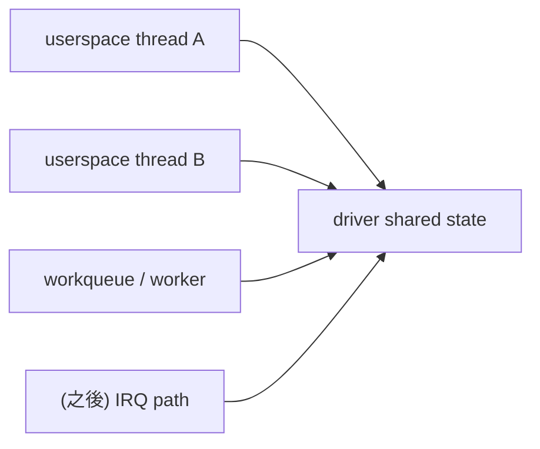

# 併發與同步白話前導

## 這份文件是給誰的

如果你目前：

- 還沒寫過 kernel module
- 沒處理過 race condition
- 看到 `mutex`、`spinlock`、`waitqueue`、`completion` 會直接卡住

那請先看這份，再進 [`../../labs/04-locking-and-races`](../../labs/04-locking-and-races)。

## 先講結論

`04-locking-and-races` 真正要你學的，不是 API 名字本身，而是：

> 同一份 kernel state，被多個執行路徑碰到時，怎麼避免它壞掉。

## 最小心智模型

先把情境想成這樣：

> **逐步說明：**
>
> 1. **userspace thread A/B 同時進 driver**：不同 process 或 thread 可以同時呼叫同一個 device node 的 callback。
> 2. **worker 也可能碰 state**：driver 內部的背景工作不一定等 userspace 做完才跑。
> 3. **IRQ path 之後會加入**：`06/07` 開始，中斷 handler 也可能碰 driver state。
> 4. **共同指向 shared state**：只要兩條以上路徑會讀寫同一份資料，就要設計同步與 lifetime。
>
> **白話總結**：shared state 像一張共用表單，多個人同時改就會亂；lock 的目的就是讓關鍵欄位一次只被一個人改。

只要有兩條以上的路徑碰到同一份資料，就會開始出現：

- race
- state 不一致
- resource 被提早釋放
- thread A 還在用，thread B 已經 cleanup

## 什麼是 race

白話：

- 結果取決於「誰先跑到哪一步」

例如：

1. thread A 讀到 `counter = 0`
2. thread B 也讀到 `counter = 0`
3. A 加一後寫回 `1`
4. B 加一後也寫回 `1`

你本來以為會變 `2`，結果最後變 `1`。

這就是最基本的 race。

## 為什麼 `03` 做完後，下一關是同步

因為到 `03` 為止，你已經開始有：

- userspace write path
- userspace ioctl path
- userspace poll/read path
- shared buffer
- shared event state

這些東西只要一多執行緒，就會開始碰到同步問題。

## 先不要急著背全部工具

新手第一輪先只抓這樣：

### `mutex`

你可以先把它理解成：

- 給「一般 process context」用的鎖
- 進 critical section 前先上鎖
- 離開時解鎖

適合：

- `read/write/ioctl`
- 可能會睡眠的 path

### `spinlock`

先把它理解成：

- 比較低階、不能隨便睡眠的鎖

新手先記：

- 不要在還沒搞懂 context 差異前亂用
- `04` 第一版通常先用 mutex 練到會

### `waitqueue`

白話：

- 「先睡著，等條件成立再醒來」

它常用在：

- blocking read
- poll
- 等某個狀態改變

### `completion`

白話：

- 等待「某件一次性的事情完成」

你可以先把它想成：

- 一個比較明確的「完成通知」

## `04` 最適合新手的學法

### 第一輪

- 不要急著追 KCSAN / lockdep
- 先用 2 個 userspace thread 去踩 shared state
- 親眼看到 race 或不一致

### 第二輪

- 補 mutex
- 再跑一次相同測試
- 看結果差異

### 第三輪

- 再去理解 waitqueue、completion、worker lifecycle

## 這一關真正要回答的問題

1. 哪些資料是共享的？
2. 哪些 path 會碰到它？
3. 哪些 path 可以睡眠？哪些不行？
4. cleanup 時，會不會還有人拿著舊指標？

## 新手最常犯的錯

- 一看到 race 就直接亂加很多鎖
- 還沒畫 shared state，就開始改 code
- 沒先做「可重現問題」版本
- 修完之後沒有用同一組測試再驗一次

## 你現在只要先記住的話

> `04` 不是在背鎖的 API，而是在學「如何保護共享狀態」。
