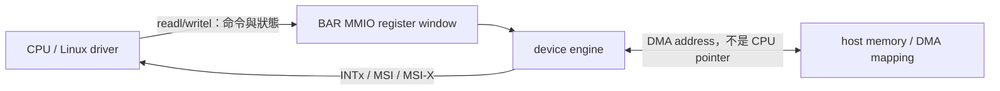

# PCIe / BAR / MMIO / IRQ / DMA 白話前導

> 這份文件是 Lab05～Lab07 的最低共同地圖。它刻意不展開完整 PCIe 協定，但不以錯誤簡化交換易讀性。

## 先講結論

Linux PCI host driver 的第一個完整閉環是：

```text
PCI core 列舉 function
→ driver / device match
→ probe() 取得並驗證資源
→ BAR/MMIO 控制裝置
→ IRQ 接收事件
→ DMA 搬大量資料
→ remove/error path 先 quiesce，再釋放資源
```

Lab05、Lab06、Lab07 分別把這條路徑切成 MMIO、IRQ、DMA 三個可驗證階段。

## 最小互動圖



這三條路徑的角色不同：

- **MMIO**：低頻控制與狀態，不是大量 payload 通道。
- **IRQ**：通知「有事件」，不自動證明 payload 正確。
- **DMA**：裝置主動讀寫 host memory；driver 必須處理 address、ownership、ordering、completion 與 lifetime。

---

## 1. PCI core 如何讓 driver 找到裝置

Firmware 與 Linux PCI core 會走訪 PCI hierarchy、讀 configuration space，為每個 PCI function 建立 `struct pci_dev`。Driver 透過 `struct pci_driver.id_table` 宣告可支援的 Vendor/Device ID 等條件。

當下列條件同時成立時，driver core 才嘗試 bind 並呼叫 `probe()`：

- PCI function 已被列舉；
- driver 已註冊；
- ID／class 等 match；
- function 尚未由其他 driver 擁有；
- 沒有被 policy、deferred probe 或錯誤狀態阻擋。

所以：

```text
lspci 看不到 device
≠ probe 寫錯
```

如果 guest 內看不到 QEMU EDU `1234:11e8`，問題發生在 driver bind 之前，應先查 QEMU 參數、guest PCI enumeration 與環境。

Driver 先出現或 device 先出現都可以。兩者都就緒時，driver core 會執行 match/bind；但「所有 PCIe 裝置都支援任意實體熱插拔」不是通則，實體 hotplug 仍取決於 slot、controller、firmware 與平台支援。

---

## 2. Configuration space 與 BAR

Configuration space 是每個 PCI function 的標準化描述區，包含：

- Vendor/Device ID 與 class；
- Command/Status；
- BAR registers；
- PCI、PM、MSI/MSI-X、PCIe、AER 等 capability。

BAR 是 configuration header 中的資源描述欄位。它描述 function 需要或已被配置的 I/O／memory resource window；BAR raw value 不是可以直接解參考的 CPU virtual address。

Driver 應使用 PCI core 已解析的 resource view：

```c
pci_resource_flags(pdev, bar);
pci_resource_start(pdev, bar);
pci_resource_len(pdev, bar);
pci_request_region(pdev, bar, name);
base = pci_iomap(pdev, bar, 0);
```

三個 view 不要混在一起：

1. **BAR raw register value**：含 type/prefetch/64-bit 等 encoding。
2. **PCI resource**：kernel 經 host bridge translation 後管理的 address range。
3. **`void __iomem *` mapping**：driver 最後交給 I/O accessor 的 kernel virtual I/O mapping。

---

## 3. MMIO

MMIO 把 device register 或 device memory window 放進 CPU 可存取的 I/O address space。它外觀看似 pointer，語意卻不是一般 RAM。

正確用法：

```c
u32 value = ioread32(base + offset);
iowrite32(value, base + offset);
```

不要使用：

```c
*(u32 *)(base + offset)
memcpy(base, buf, len)
```

除非 device I/O API 明確提供相應 helper，例如 `memcpy_toio()`／`memcpy_fromio()`。

I/O accessor 負責 architecture-specific access、width、endianness 與 ordering contract；`__iomem` 也讓 sparse 能抓出錯誤 pointer 使用。

### 正常 accessor、relaxed accessor、posted completion 是三件事

- `readl()`／`writel()` 或 `ioread32()`／`iowrite32()`：使用 Linux 定義的正常 I/O ordering contract。
- `readl_relaxed()`／`writel_relaxed()`：弱化與 normal memory 等操作的 ordering；只有在另有明確同步時才使用。
- PCI memory write 通常是 **posted**：write accessor 返回，不等於裝置已收到，更不等於命令已執行完成。

需要確認先前 posted write 已抵達同一裝置時，可依 datasheet 讀一個安全 register作 read-back。Read completion只能證明前面的write已推進到相應ordering point；裝置是否完成工作仍要看status bit、IRQ、completion queue或device-specific protocol。

---

## 4. IRQ

IRQ 是裝置通知 host「狀態改變或工作完成」的事件路徑。PCI/PCIe 常見：

- legacy INTx；
- MSI；
- MSI-X。

MSI/MSI-X 不是實體中斷線，而是裝置向平台配置的message address發出Memory Write Request。Linux driver常用：

```c
nvec = pci_alloc_irq_vectors(pdev, min, max, flags);
irq = pci_irq_vector(pdev, index);
request_irq(irq, handler, irq_flags, name, dev_id);
```

Hard IRQ handler 的基本規則：

- 不能呼叫可能睡眠的API；
- 先判斷是否為自己的事件，shared INTx不屬於自己時回`IRQ_NONE`；
- 依device規格ack／mask source，避免interrupt storm；
- 只做短而有界的工作，較重工作交給threaded IRQ、workqueue、tasklet/softirq或subsystem-specific mechanism；
- teardown先阻止新IRQ source，再同步in-flight handler，最後free IRQ/vector。

「收到IRQ」只驗notification path。資料內容仍需status、length、sequence、checksum或compare等驗證。

---

## 5. DMA

DMA讓裝置直接讀寫host memory，但device不能使用CPU virtual pointer。

Driver最少要區分：

| View | 使用者 |
|---|---|
| CPU virtual address | kernel CPU code |
| physical page layout | memory subsystem／platform |
| DMA address (`dma_addr_t`) | device |

有IOMMU時，DMA address通常是IOVA；無IOMMU時也不能由driver自行假設它等於任意CPU physical address。必須使用DMA API。

### DMA mask

```c
ret = dma_set_mask_and_coherent(dev, DMA_BIT_MASK(n));
```

這是driver據實宣告hardware可表示的DMA address bits，不是「設越大越好」。回傳失敗時不能繼續DMA。

### Coherent 與 streaming

**Coherent allocation**：

```c
cpu_addr = dma_alloc_coherent(dev, size, &dma_handle, gfp);
```

- CPU使用`cpu_addr`；
- device使用`dma_handle`；
- 免除per-transfer cache flush/invalidate；
- 不免除ownership、ordering、completion與teardown lifetime。

**Streaming mapping**：

```c
dma = dma_map_single(dev, cpu_addr, size, direction);
```

- direction是契約的一部分；
- mapping交給device後，CPU不可任意同時讀寫；
- 重用mapping時用`dma_sync_*_for_cpu/device()`交接ownership；
- 用完`dma_unmap_*()`；
- map/sync不會替你等待device完成。

### Ordering 與 completion

Descriptor/ring常見模式：

```text
CPU填欄位
→ dma_wmb()
→ publish OWN/VALID/index
→ 用正常MMIO accessor敲doorbell
```

回收時：

```text
先由status/ownership/IRQ知道device已交還
→ dma_rmb()
→ CPU讀device寫入的欄位或payload
```

Barrier只建立order，不會等待device，也不會自動轉移ownership。

---

## 6. 五個容易混成一團的詞

| 詞 | 問的問題 |
|---|---|
| **coherent / visible** | 對方能否看到最新值？ |
| **ordered** | 多筆access被觀察的先後是否正確？ |
| **arrived** | posted MMIO write是否已到達相應device/path？ |
| **complete** | device operation是否真的做完？ |
| **correct** | address、length、direction與payload結果是否正確？ |

一個IRQ到了，不代表payload正確；一個read-back完成，不代表device operation做完；coherent buffer也不代表descriptor欄位順序正確。

---

## 7. Lab05～Lab07地圖

### Lab05：PCI bind + BAR/MMIO

```text
EDU存在
→ ID match
→ probe
→ validate/request/map BAR0
→ identification/liveness
→ remove/error unwind
```

### Lab06：IRQ

```text
Lab05資源
→ clear stale pending source
→ alloc vector/request handler
→ trigger event
→ handler判斷/ack/complete
→ quiesce + synchronize + free
```

### Lab07：DMA

```text
Lab06資源
→ set truthful DMA mask
→ coherent CPU pointer + DMA handle
→ program address/count/command
→ wait completion + verify idle
→ compare payload
→ prove quiesce before free
```

通過Lab07代表完成第一個教學閉環，不代表已具備production multi-queue、streaming SG、hot-unplug、AER與firmware recovery設計。

---

## Self-check

1. BAR raw value、PCI resource、`__iomem` mapping有什麼差別？
2. 為什麼device不能使用kernel pointer做DMA？
3. `writel()`返回、same-device read-back返回、status/IRQ完成各證明什麼？
4. Coherent DMA免除了什麼？仍未免除什麼？
5. 收到DMA completion IRQ後，為什麼還要驗證status與payload？

<details>
<summary>參考答案</summary>

1. BAR raw value是config register encoding；PCI resource是core解析與host bridge轉換後管理的range；`__iomem` mapping是driver交給I/O accessor使用的kernel I/O virtual address。
2. Kernel pointer只在CPU virtual address space有意義；device需要DMA API建立、限制並回傳的`dma_addr_t`，其中可能包含IOMMU translation、bounce或platform offset。
3. `writel()`返回表示CPU完成該accessor的提交語意；same-device read-back可作posted-write completion point；status/IRQ/CQ才依device protocol表示operation完成，但仍不保證payload內容正確。
4. Coherent allocation免除per-transfer cache maintenance並提供CPU/device互見；仍需truthful mask、CPU pointer與DMA handle分離、ownership、barrier、device completion、concurrency及quiesce-before-free。
5. IRQ只證明notification發生；錯誤address、direction、count、device-local offset或資料損毀仍可能同時存在，因此要查status並以pattern、sequence、checksum或`memcmp()`驗payload。

</details>

## 官方查證入口

- Linux PCI driver guide: <https://docs.kernel.org/PCI/pci.html>
- PCI support library: <https://docs.kernel.org/driver-api/pci/pci.html>
- Device I/O accessors: <https://docs.kernel.org/driver-api/device-io.html>
- MSI guide: <https://docs.kernel.org/PCI/msi-howto.html>
- DMA API HOWTO: <https://docs.kernel.org/core-api/dma-api-howto.html>
- Memory barriers: <https://docs.kernel.org/core-api/wrappers/memory-barriers.html>
- Generic IRQ: <https://docs.kernel.org/core-api/genericirq.html>
- QEMU EDU: <https://www.qemu.org/docs/master/specs/edu.html>
