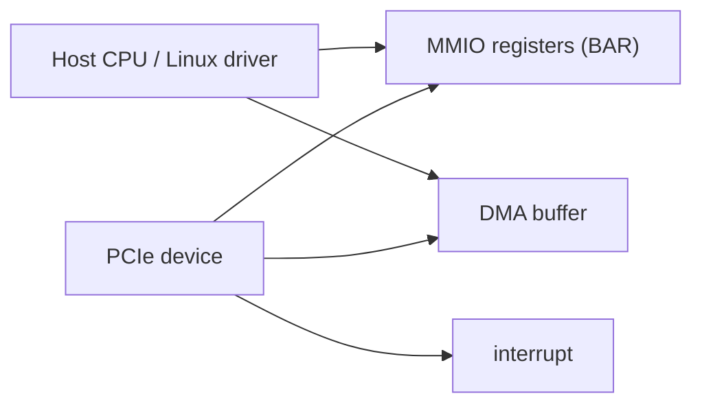

# PCIe / MMIO / IRQ / DMA 白話前導

## 這份文件是給誰的

如果你現在對這些字還很抽象：

- PCIe
- BAR
- MMIO
- IRQ
- DMA

那在看 `05-07` 之前，先看這份。

## 先講結論

`05-07` 真正要你學的，不是規格書細節，而是：

> Linux host driver 怎麼找到裝置、碰到 register、接中斷、和讓裝置搬資料。

## 先建立最小圖像

這張圖對應 3 個核心互動：

1. CPU 透過 register 控制裝置
2. 裝置透過 interrupt 通知 CPU
3. CPU 與裝置透過 DMA buffer 交換大量資料

## 什麼是 PCIe device discovery

白話：

- 系統開機後，kernel 會掃描 PCI 裝置
- 如果某個 driver 宣告「我支援這個 device ID」
- kernel 就會把這顆裝置交給它的 `probe()`

所以 `probe()` 的白話就是：

- `這顆裝置現在分配給你了，你要不要接手？`

## 什麼是 BAR

先不要把它想太複雜。

你可以先把 BAR 理解成：

- PCIe 裝置暴露給 host 的一塊位址空間入口

driver 會先拿到 BAR，再把它 map 成可存取的 register 視角。

## 什麼是 MMIO

白話：

- Memory-Mapped I/O
- 看起來像記憶體位址，但其實是在存取裝置 register

對新手先記：

- 不是一般 RAM
- 讀寫它通常是在跟裝置對話

## 什麼是 IRQ

白話：

- 裝置對 CPU 說：「有事情了，你來看一下」

常見情境：

- 命令完成
- 錯誤發生
- DMA 完成

所以 `06` 的本質是：

- 不是你一直去問裝置有沒有完成
- 而是裝置主動叫你

## 什麼是 DMA

白話：

- 裝置直接跟記憶體搬資料，不必每個 byte 都讓 CPU 親手 copy

對新手先記住：

- 少量控制資訊通常走 MMIO register
- 大量 payload 比較常走 DMA

## `05-07` 各自在補什麼

### `05-pci-edu-mmio`

你在學：

- kernel 怎麼把這顆 PCI 裝置交給你的 driver
- 你怎麼拿到 BAR，開始讀 register

### `06-pci-edu-irq`

你在學：

- 裝置怎麼通知你一個事件
- 你怎麼在 handler 裡接住它、清掉它

### `07-pci-edu-dma`

你在學：

- 哪一塊 memory 可以給裝置安全地看到
- DMA 搬運完成後怎麼驗證資料與 cleanup

## 新手最容易卡住的地方

### 1. 把 register 跟一般記憶體混在一起

不要這樣想。

先分清楚：

- 一般 RAM
- MMIO register
- DMA buffer

這三者不是一回事。

### 2. 還沒懂 `05` 就跳 `07`

不行。

因為：

- 你連 device 都還沒穩定接手
- BAR / register / probe 都沒搞懂
- 直接碰 DMA 只會一起糊掉

### 3. 一開始就想學產品級 PCIe 細節

現在不用。

你先把：

- `probe/remove`
- BAR map
- IRQ
- DMA buffer

這些共通骨架學會，才是對的順序。

## `05-07` 最適合新手的學法

1. 先讀這份 primer
2. 再看 [`../../qemu/edu-bringup-checklist.md`](../../qemu/edu-bringup-checklist.md)
3. 先確認 guest 內真的看得到 `1234:11e8`
4. 先做 `05`
5. 再做 `06`
6. 最後才做 `07`

## 你現在只要先記住的話

> `05-07` 不是在學「某顆特定卡」；是在學 PCIe accelerator host driver 的共通骨架。
