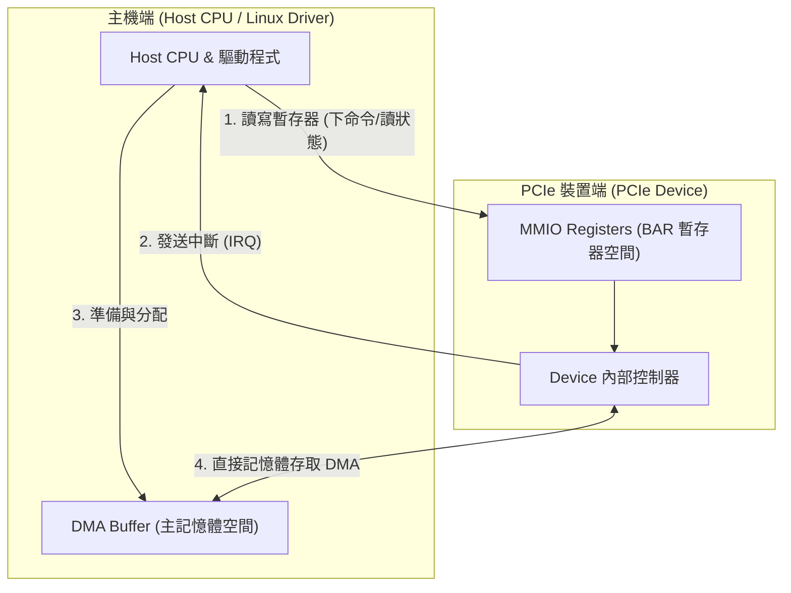
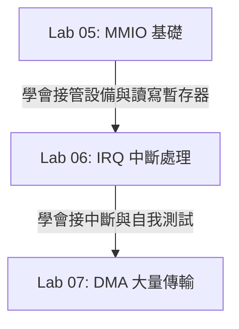

# PCIe / MMIO / IRQ / DMA 白話前導

## 這份文件是給誰的

如果你現在對以下名詞還感到抽象：
- **PCIe** (PCI Express)
- **BAR** (Base Address Register)
- **MMIO** (Memory-Mapped I/O)
- **IRQ** (Interrupt Request)
- **DMA** (Direct Memory Access)

在開始閱讀 `05` 到 `07` 的驅動程式碼之前，強烈建議先讀完這份引導，建立正確的心智模型。

## 先講結論

Lab 05 到 07 的核心目標，不是要你背誦繁雜的 PCIe 協定規格書，而是要掌握：
> **Linux Host 驅動程式如何「找到裝置」、「存取暫存器」、「接收中斷」以及「讓裝置直接搬移資料」。**

---

## 建立 Host 與 Device 的最小互動圖像

這張圖展示了 Linux Host（CPU 與驅動程式）與 PCIe 裝置之間的三大核心互動機制：

### 核心互動的逐步說明：

1. **MMIO 控制（圖中步驟 1 與 R -> D）**
   * **Host CPU -> MMIO Registers (BAR)**：驅動程式透過 BAR（Base Address Register）所映射出來的暫存器視窗，使用 `ioread32()` / `iowrite32()` 讀寫設備暫存器。這就像控制面板上的按鈕，CPU 透過按這些按鈕來給設備下達指令（例如：「開始計算」、「啟動 DMA」）或讀取目前硬體狀態。
   
2. **中斷通知（圖中步驟 2）**
   * **Device -> Host CPU (IRQ)**：當設備完成任務（例如：「運算完畢」、「DMA 搬移完成」）或發生錯誤時，它會發送中斷訊號（Interrupt）給 Host。CPU 收到後會暫停手邊工作，跳進驅動程式註冊的中斷處理函式（Interrupt Handler）中做處理。如此一來，CPU 就不必一直用迴圈輪詢（Polling）設備，節省系統效能。

3. **直接記憶體存取 DMA（圖中步驟 3 與 4）**
   * **Host CPU -> DMA Buffer**：當需要傳輸大量數據時，CPU 不會自己用 Loop 一個一個 Byte 搬運。驅動程式會先在系統記憶體（DRAM）中配置一塊專屬空間（DMA Buffer），並將這塊記憶體的實體地址告訴裝置。
   * **Device <-> DMA Buffer**：裝置內的 DMA 控制器會透過 PCIe 總線，直接去讀寫這塊記憶體空間（可以直接讀取 Host 送來的資料，或是將產出直接寫回 Host 記憶體）。傳輸完成後，設備再發送中斷通知 CPU 來收工。

> [!TIP]
> **白話比喻**：MMIO 像「控制面板」，IRQ 像「通知門鈴」，DMA Buffer 則是雙方都能直接取放大量貨物的「共享工作台」。

---

## 核心術語白話解析

### 1. 什麼是 PCIe device discovery (裝置偵測)？
* **白話**：系統開機或總線掃描時，Linux 核心（PCI Core）會自動掃描匯流排上的所有插槽。
* 如果發現某個插槽上的裝置 Vendor/Device ID（例如 QEMU EDU 的 `1234:11e8`）與你的驅動程式宣告的 `id_table` 匹配，核心就會把這個設備物件交給驅動程式的 `probe()` 函數。
* **`probe()` 的白話含意**：核心問你：「這顆設備現在分給你了，你要不要接手並初始化它？」

### 2. 什麼是 BAR (Base Address Register)？
* **白話**：裝置上的暫存器要怎麼讓 CPU 存取？裝置在插上匯流排時，會告訴系統：「我需要一塊實體地址窗口來暴露我的暫存器」。
* 這一組窗口的基底地址就記錄在 BAR 暫存器中。驅動程式取得 BAR 的物理地址與長度後，會將其映射成虛擬地址，這就是你存取裝置暫存器的入口。

### 3. 什麼是 MMIO (Memory-Mapped I/O)？
* **白話**：將裝置的暫存器映射到 CPU 的記憶體地址空間中。
* 當你讀寫這些特定的虛擬地址時，**它並不是讀寫普通的系統 RAM，而是直接在讀寫裝置內部的暫存器**。
* 在編寫驅動時，**絕對不能**像普通指標那樣直接解參考（Dereference），而必須使用內建的存取函式（如 `ioread32`、`iowrite32`）以確保讀寫順序（Memory Barrier）正確。

### 4. 什麼是 IRQ (Interrupt Request)？
* **白話**：裝置主動向 CPU 告警：「我有新進展了，你過來看一眼」。
* 驅動程式會註冊一箇中斷處理函式，當中斷觸發時，核心會叫醒這個函式來處理任務，例如清空狀態暫存器或喚醒等待中的程序。

### 5. 什麼是 DMA (Direct Memory Access)？
* **白話**：讓硬體設備有權力「自己去讀寫系統記憶體」，不需要 CPU 在中間做搬運工。
* 驅動程式負責「分配記憶體」與「把地址告訴裝置」；設備負責「直接搬運」；搬完後「發送中斷通知 CPU」。

---

## Lab 05 ~ 07 階梯式學習地圖

這三個 Labs 實作的其實是**同一個驅動程式的三個漸進擴充階段**，請務必按照順序學習，不要越級：

1. [**05-pci-edu-mmio**](file:///home/ubuntu/driver-lab/labs/05-pci-edu-mmio/README.md)：
   * **目標**：確認你的驅動程式能成功 bind 到虛擬裝置，並成功映射 BAR0，能讀寫基本的 Identification / Liveness 暫存器。
2. [**06-pci-edu-irq**](file:///home/ubuntu/driver-lab/labs/06-pci-edu-irq/README.md)：
   * **目標**：在 05 的基礎上，加入中斷機制。能成功向核心註冊 IRQ，當對暫存器寫入觸發中斷時，你的 Interrupt Handler 能接住並正確清除中斷狀態。
3. [**07-pci-edu-dma**](file:///home/ubuntu/driver-lab/labs/07-pci-edu-dma/README.md)：
   * **目標**：在 05 與 06 的基礎上，配置一致性 DMA 緩衝區（Coherent DMA Buffer），控制裝置把資料從 A 點搬到 B 點，並驗證搬移結果。

---

## 新手防踩坑守則

1. **分清 MMIO Register 與 DMA Buffer**：
   * **MMIO Register**：是硬體控制面板，通常只有幾個 Byte 大，用來寫命令、讀狀態。
   * **DMA Buffer**：是主記憶體中的數據緩衝區，容量較大，用來放置實際要傳輸的數據（Payload）。
2. **不要越級挑戰**：
   * 在 `05` 的 `probe()`、BAR0 映射、Liveness Check 還沒完全穩定前，絕對不要急著寫 `06` 的中斷或 `07` 的 DMA，否則一旦出錯會極難排查。
3. **區分 Host 與 Guest 的執行邊界**：
   * 你的編譯環境與測試載入環境必須在 **Linux Guest 虛擬機** 內執行（可用 `lspci` 檢查是否看得到裝置），Host OS（例如 macOS）只負責啟動 QEMU 並掛載該虛擬設備，無法直接載入驅動。
