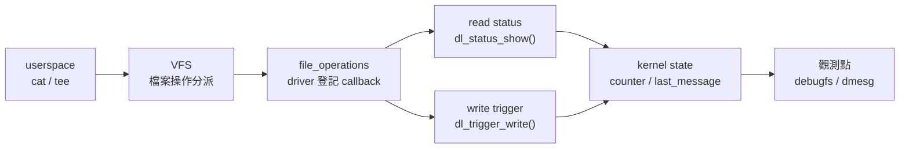

# 00 到 01：debugfs 過渡導讀

這份文件回答你剛做完 `00-hello-module` 後最容易遇到的問題：

> 我是不是應該直接進 `01-debugfs-logging`？為什麼突然多了這麼多看不懂的 struct 和 callback？

答案是：可以進 `01`，但不要用「逐行看懂所有 kernel API」當第一輪目標。`01` 的第一輪目標只有一個：

> driver 不只要印 log，還要把自己的狀態用 debug 介面導出來，讓你可以從 userspace 觀察。

## 從 00 到 01 多了什麼

`00` 只有這條路：

```text
insmod -> module_init() -> pr_info() -> dmesg
```

`01` 多了兩條 userspace 觀測路：

```text
cat status      -> driver 把 kernel state 轉成文字
tee > trigger   -> driver 收到 userspace 傳進來的 bytes，更新 kernel state
```

你第一次讀 `01` 時，不要先追 `struct inode`、`struct file`、`struct seq_file` 的完整定義。先把它們當成 kernel 幫你把「檔案操作」接到 driver callback 的中間物件。

## 這一關的資料流



> **逐步說明：**
>
> 1. **userspace 發出檔案操作**：你執行 `cat status` 或 `tee > trigger`，看起來是在操作檔案。
> 2. **VFS 分派操作**：Linux VFS 看到這不是普通檔案，而是 debugfs 交給 driver 的檔案。
> 3. **`file_operations` 接到 callback**：driver 用 `dl_status_fops` 和 `dl_trigger_fops` 告訴 kernel，讀寫時要呼叫哪些函式。
> 4. **callback 讀寫 kernel state**：`dl_status_show()` 負責把 state 印成文字，`dl_trigger_write()` 負責接收 payload 並更新 state。
> 5. **從 debugfs / dmesg 觀測結果**：你可以用 `cat` 看狀態，也可以用 `dmesg` 看 log。
>
> **白話總結**：`01` 像是幫 driver 開一個「維修觀察窗」；你不是直接碰 kernel 內部，而是透過 debugfs 檔案看它現在記住了什麼。

## 第一輪必懂

| 你看到的東西 | 第一輪理解 |
|---|---|
| `debugfs` | 給 driver 開 debug 觀測入口的檔案系統，不是正式產品 ABI。 |
| `status` | 給人讀的狀態檔；`cat status` 最後會走到 `dl_status_show()`。 |
| `trigger` | 給人寫的觸發檔；`tee > trigger` 最後會走到 `dl_trigger_write()`。 |
| `trigger_count` | 一個 counter，讓你確認 write path 真的被觸發。 |
| `emit_debug` | 一個 debug 開關，讓你觀察 `pr_debug()` 路徑。 |
| dynamic debug | kernel 提供的機制，可在 runtime 選擇性打開 `pr_debug()`。 |

## 第一輪可以先略過

| 你看到的東西 | 為什麼可以先略過 |
|---|---|
| `struct inode` 的完整內容 | 這是 VFS 內部物件；第一輪只要知道 open callback 會收到它。 |
| `struct file` 的完整內容 | 這也是 VFS 內部物件；第一輪只要知道 read/write callback 會收到它。 |
| `struct seq_file` 的完整機制 | 它是輸出文字用的 helper；先知道 `seq_printf()` 會產生 `cat status` 看到的文字即可。 |
| dynamic debug query language 完整語法 | 第一輪只用 `module driver_lab_debugfs_logging +p` 這一種查詢。 |
| debugfs API 的所有 helper | 先看本 lab 用到的 `debugfs_create_file()`、`debugfs_create_u32()`、`debugfs_remove()`。 |

## 之後再回來補

完成 `01` 後，你可以等到 `02` 再更認真理解 `file_operations`。原因是：

- `01` 的 `file_operations` 是為 debugfs 檔案服務。
- `02` 的 `file_operations` 會接到真正的 `/dev/driver_lab_char0`。
- 兩者都會經過 VFS，但學習目的不同。

所以正確節奏是：

1. `01`：先知道「debugfs 檔案也能接 driver callback」。
2. `02`：再理解「正式 device node 的 read/write 也走 callback」。
3. `03`：再加入 `ioctl`、`poll`、`mmap`，把 user-kernel ABI 拆清楚。

## `test.sh` 裡 dynamic debug 那段在做什麼

`01` 的 test 裡有這段：

```sh
if [ -e /proc/dynamic_debug/control ]; then
	echo 'module driver_lab_debugfs_logging +p' | sudo tee /proc/dynamic_debug/control >/dev/null
	printf '%s' 'smoke-two' | sudo tee /sys/kernel/debug/driver_lab_debugfs/trigger >/dev/null
fi
```

逐行看：

- `if [ -e /proc/dynamic_debug/control ]`：先確認這顆 kernel 有 dynamic debug。沒有就跳過，不把它當成 lab 失敗。
- `module driver_lab_debugfs_logging +p`：只打開這個 module 裡的 `pr_debug()` print flag。
- 寫進 `/proc/dynamic_debug/control`：把上面的控制命令交給 kernel dynamic debug 機制。
- 再寫一次 `trigger`：讓 driver 再跑一次 write path，這次如果 `pr_debug()` 被打開，就有機會看到 debug log。

第一輪你只要記住：

> `pr_info()` 通常直接看得到；`pr_debug()` 常常要透過 dynamic debug 打開才看得到。

## 讀 `01` source code 的最低順序

如果你完全看不懂 `driver_lab_debugfs_logging.c`，先只找這 5 個位置：

1. `driver_lab_debugfs_logging_init()`：module 載入後建立 debugfs 目錄與檔案。
2. `debugfs_create_file("status", ...)`：建立可讀的 `status` 檔。
3. `debugfs_create_file("trigger", ...)`：建立可寫的 `trigger` 檔。
4. `dl_trigger_write()`：寫 `trigger` 後，counter 和 last message 在這裡更新。
5. `dl_status_show()`：讀 `status` 時，輸出的文字在這裡產生。

你不需要在第一輪記住所有 helper 的原型。先把命令、callback、觀測結果串起來。
