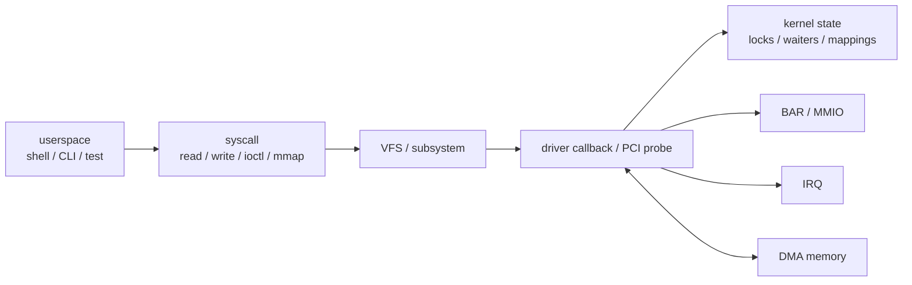

# START HERE — 從 0 基礎走完 Linux host-driver labs

> **定位**：這是 `driver-lab` 唯一的新手總入口。第一次進 repo、忘記下一步、或覺得文件太多時，只回到這一頁。

## 先講結論

這個 repo 刻意把 Linux host driver 拆成十個可驗證的小閉環：

```text
module lifecycle
→ debugfs / logging
→ char-device read/write
→ ioctl / poll / mmap
→ concurrency / lifetime
→ PCI BAR / MMIO
→ IRQ
→ DMA
→ userspace runtime
→ stress / fault-injection scaffold
```

你不需要先把 kernel、PCIe 或所有 `.md` 看完。每一關都只走：

```text
讀該 Lab README 的結論與名詞
→ 畫 resource / data flow
→ 讀 current source 的入口、正常路徑、error path、teardown
→ 跑 test
→ 保存 evidence
→ 闔上 README 回答 Self-check
```

## 不確定處與驗證狀態

- `review/accuracy-audit-2026-08` 是技術正確性基線。
- `review/pedagogy-pass-2026-08` 在其上改善教學結構與文件導航。
- CI 的 static、link、build、external-module compile 不等於 module runtime proof。
- Labs05～07 的 MMIO、IRQ、DMA 仍需能看見 QEMU EDU 的 Linux guest 實跑。
- QEMU EDU 只教 Linux PCI software model，不取代真實卡的 datasheet、firmware、reset、AER、PM 與 PHY/link 驗證。

## 最小心智模型



第一輪只要知道：userspace 或 kernel core 會呼叫 driver 入口；driver 取得 resource、處理 state、與 device 互動，最後必須在 teardown 前先停止所有仍會使用 resource 的執行者。

## 打開一個 Lab 目錄時，先看什麼

| 檔案 | 角色 | 第一輪閱讀深度 |
|---|---|---|
| `README.md` | 主教材、命令、evidence、limits | 必讀 |
| `driver_*.c` / runtime `.c` | current implementation | 找入口、shared state、resource、error/teardown |
| `test.sh` | smoke/regression oracle | 看它實際驗什麼、如何失敗 |
| `debug-checklist.md` | 該 Lab 的故障排查 | 失敗時再看 |
| `Makefile` | kbuild 或 userspace build glue | 知道輸入、target、KDIR 即可 |
| `*_uapi.h` | kernel/userspace ABI | Lab03/04 起需要仔細讀 |
| `<source>.md` | generated/line-by-line companion | source 讀不懂時旁讀，不當 authority |

不要用普通 `gcc driver.c` 編 kernel module；external module 交給 kbuild。不要把 `quality.sh` 當 module runtime test。

## 十關學習路線與前進 gate

| Lab | 核心問題 | 最小 evidence | 前進前要能說明 |
|---|---|---|---|
| 00 | module 如何 build/load/unload | init/exit、parameter、invalid load | failed init 為何自己 unwind |
| 01 | 如何安全導出 debug state | debugfs trigger/status、controlled log | debugfs 為何不是 stable UAPI |
| 02 | `/dev` 如何進 read/write callback | node/sysfs/proc、read/write | global record 與 per-open state 差別 |
| 03 | data/control/event/mapping 如何分工 | ioctl/poll/two-reader/read-only mmap | wakeup 為何只要求 recheck predicate |
| 04 | shared state 如何避免 lost update/UAF | unsafe vs safe、worker stop | mutex、READ_ONCE、kthread_stop 各解什麼 |
| 05 | PCI function 如何 bind、claim/map BAR | EDU enumeration、ident/liveness | BAR raw/resource/`__iomem` 差別 |
| 06 | device event 如何成為 IRQ callback | vector、status、ACK、bounded wait | source、transport、Linux IRQ、handler 差別 |
| 07 | device 如何使用 host memory | truthful mask、兩次 transfer、compare | CPU pointer、DMA address、EDU-local address 差別 |
| 08 | application 如何安全消費 UAPI | runtime/unit/CLI build、device smoke | fd/mapping ownership、partial I/O |
| 09 | 如何讓 bug 修正可重現 | reload/parallel oracle | stress、sanitizer、fault injection 的證據邊界 |

### 第一段：Labs00～02

目標是 module lifecycle、觀測、VFS/cdev/usercopy。不要急著進 QEMU。

### 第二段：Labs03～04

目標是 ABI、blocking/event、mmap snapshot、concurrency 與 lifetime。進 PCI 前至少能畫出哪些 execution paths 共享 state。

### 第三段：Labs05～07

先讀 [`../concepts/pcie-primer.md`](../concepts/pcie-primer.md)，再依序做 MMIO → IRQ → DMA。環境與操作見 [`linux-environment.md`](linux-environment.md) 與 [`../guides/lab-05-study-order.md`](../guides/lab-05-study-order.md)。

### 第四段：Labs08～09

把 raw UAPI 變成 userspace runtime，並將正常路徑、error path、reload、parallel access 變成 regression evidence。

## 會一直出現的名詞

| 名詞 | 第一輪定義 | 不代表什麼 |
|---|---|---|
| resource | driver 取得並必須管理 lifetime 的物件，例如 dev_t、page、BAR、IRQ、DMA mapping | 只指 memory |
| execution context | 某段 code 執行時的規則，例如 task、hard IRQ、worker | process/thread 的單一分類 |
| callback | kernel/VFS/IRQ core 在事件發生時呼叫的 function | userspace 直接 call kernel address |
| ownership | 某段時間誰可修改、消費或釋放 resource/data | 只有 C pointer owner |
| ordering | 不同 access 對 observer 可見的先後 | operation 已完成 |
| completion | 依 protocol 某個事件/工作已完成 | payload 一定正確 |
| quiesce | 拒絕新工作、停止 producer、等待 in-flight users 退出 | 只設一個 bool |
| UAPI | userspace 可依賴的 ABI/data layout | 可隨 internal struct 任意改變 |
| BAR / MMIO | device resource window 與其 register access path | ordinary cached RAM |
| DMA address | DMA API 回傳、寫給 device 的 address | CPU virtual pointer |

更多 filesystem/API 角色見 [`kernel-interfaces.md`](kernel-interfaces.md)。

## 每個 API 固定問六件事

1. 誰呼叫它？
2. 目前 execution context 可不可以 sleep？
3. 哪些參數是 input、output、前一步 resource、數量、名字或 callback table？
4. 成功後哪個 resource/state 開始 live？
5. 哪些其他 path 可能同時碰它？
6. Failure/remove 前要先停哪個 producer 或 in-flight user？

## 三輪讀法

### 第一輪：建立圖像

讀 README 的結論、問題、名詞、心智模型與最小流程。能畫圖就好，不追所有 API 細節。

### 第二輪：理解 contract

讀 current source、正反例、resource lifetime、error unwind、test evidence 與 limits。用 function/symbol 定位，不背固定行號。

### 第三輪：建立證據

執行 test，保存 kernel/QEMU/repo SHA、command、stdout/stderr/dmesg；再修改一個條件或觸發一個 failure path，寫 bug diary。

## Evidence 分級

| 層級 | 能證明 | 不能證明 |
|---|---|---|
| 文件/source review | contract 與 implementation 意圖已檢查 | module 可執行 |
| static/compile | 語法、連結、指定 headers 下可編譯 | MMIO/IRQ/DMA runtime 正確 |
| smoke runtime | 指定環境正常路徑可重現 | race-free、所有 error path |
| stress/sanitizer | 特定 bug class 的證據增加 | 完全無 bug |
| fault injection | 指定 failure/recovery 可重現 | 真實硬體所有 failure mode |
| real hardware | 指定 board/device/firmware 的行為 | 所有平台通則 |

## 第一次執行

```sh
./scripts/check-kernel-env.sh
(cd labs/00-hello-module && ./test.sh)
```

環境輸出看不懂時讀 [`linux-environment.md`](linux-environment.md)。

## 完成一關的最低標準

- 能指出入口、shared state、live resources、成功 evidence。
- 能解釋至少一個 error/unwind 或 teardown path。
- 能說明 test 不能證明什麼。
- 能闔上 README 回答 Self-check。
- 有 exact command 和 run-specific log，而不是只留下「passed」。

## 來源與下一步

- External modules: <https://docs.kernel.org/kbuild/modules.html>
- Driver basics: <https://docs.kernel.org/driver-api/basics.html>
- PCI driver guide: <https://docs.kernel.org/PCI/pci.html>
- 下一步：[`../../labs/00-hello-module/README.md`](../../labs/00-hello-module/README.md)
