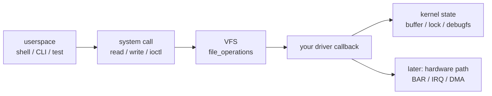

# 新手前導

## 先建立正確心智模型

如果你目前是 `0 driver 開發經驗`，最容易卡住的地方不是語法，而是你不知道自己現在到底站在哪一層。

看不懂術語時，直接配合：

- [`beginner-glossary.md`](beginner-glossary.md)
- [`check-kernel-env-explained.md`](check-kernel-env-explained.md)

這個專案最基本的圖先記住：

> **逐步說明：**
>
> 1. **userspace 發出請求**：shell、CLI 或 test script 呼叫 `read()`、`write()`、`ioctl()` 這類 system call。
> 2. **VFS 做分派**：Linux 先經過 VFS 這層，再找到對應 driver 登記的 callback。
> 3. **driver callback 執行**：你的 module 裡的函式開始處理資料、更新狀態或喚醒等待者。
> 4. **kernel state 被改變或讀出**：早期 labs 會先碰 buffer、lock、debugfs 這些容易觀測的狀態。
> 5. **之後才接硬體路徑**：PCI BAR、IRQ、DMA 會在 `05-07` 才加入。
>
> **白話總結**：userspace 像是在櫃台送出申請，VFS 像分流窗口，driver callback 才是真正處理申請的人。

你現在前 3 個 lab 的目標，不是馬上碰硬體，而是先把：

- `module lifecycle`
- `觀測`
- `user-kernel 邊界`

這三件事練穩。

## 這個專案每一關到底在練什麼

| Lab | 你實際碰到哪一層 | 新手該抓住的重點 |
|---|---|---|
| `00-hello-module` | kernel module 載入/卸載 | `insmod` 會執行 `module_init()`，`rmmod` 會執行 `module_exit()` |
| `01-debugfs-logging` | kernel 內部觀測 | 不是所有 debug 都靠亂塞 `printk`，要學會導出狀態 |
| `02-char-device` | `/dev` + `read/write` | user space 的 `read()/write()` 最後會走到你的 driver callback |
| `03-ioctl-poll-mmap` | 正式 ABI | control path、event path、shared buffer |
| `05-07` | PCI/MMIO/IRQ/DMA | 這時才開始像真正的 PCIe accelerator host driver |

## 你現在最需要理解的 5 件事

### 1. Kernel module 不是一般程式

- 它不是用 `./a.out` 執行
- 它載入後是跑在 kernel space
- 出錯時可能直接讓 kernel 噴錯，嚴重時甚至 panic

### 2. `/dev/xxx` 不等於「一個普通檔案」

- 它是一個 device node
- 你對它做 `read()` / `write()`，VFS 會轉送到 driver 的 `file_operations`
- 所以 `echo hello >/dev/driver_lab_char0` 的真正接收端，是你的 `dl_char_write()`

### 3. debugfs 不是正式產品 ABI

- 它是 debug 用
- 適合放 counter、狀態、最後一次錯誤、暫時控制開關
- 不適合當正式對外介面

### 4. 早期沒有真卡也能學很多

前半段你可以先練：

- build / load / unload
- `dmesg`
- debugfs
- `read` / `write` / `ioctl`
- race / lock / cleanup

真卡主要是留給後面的：

- vendor register map
- firmware protocol
- 真實 MSI-X / reset / AER
- 效能與平台怪 bug

### 5. 第一次不要想把 code 全看懂

正確順序是：

1. 先把 lab 跑通
2. 觀察 `dmesg`、`/sys/kernel/debug`、`/dev/...`
3. 再回頭對照 source code
4. 最後試著用自己的話解釋

做完 `00` 要進 `01` 前，先讀 [`00-to-01-debugfs-bridge.md`](00-to-01-debugfs-bridge.md)。`01` 會第一次碰到 debugfs、VFS callback、`struct file`、`struct inode`、`struct seq_file` 和 dynamic debug；第一輪看不懂它們的完整定義是正常的。

做完 `01` 要進 `02/03` 前，先讀：

- [`lab-transition-map.md`](lab-transition-map.md)
- [`01-to-03-user-kernel-abi-bridge.md`](01-to-03-user-kernel-abi-bridge.md)

`02` 會第一次把入口換成 `/dev/driver_lab_char0`，`03` 會把 `read/write` 擴成 `ioctl/poll/mmap`。第一輪先學會把命令對到 callback，不要急著追完整 VFS、`poll_table` 或 memory management。

做到後面 `08/09` 時，先讀 [`07-to-09-runtime-validation-bridge.md`](07-to-09-runtime-validation-bridge.md)。`08` 是 userspace runtime，不是 kernel driver；`09` 是 stress/regression 習慣，不代表完整 fault injection framework 已經完成。

## 你會一直反覆看到的名詞

### `module_init()` / `module_exit()`

- 載入模組時進入哪個函式
- 卸載模組時進入哪個函式

### `file_operations`

- driver 提供給 VFS 的 callback 集合
- 常見成員：`.open`、`.read`、`.write`、`.release`

### `copy_to_user()` / `copy_from_user()`

- kernel 與 user space 不能直接亂互相解 reference
- 所以資料交換要走這些 helper

### `debugfs`

- 讓 driver 導出狀態給人看
- 路徑通常在 `/sys/kernel/debug/...`

## 每做一關都要回答這 4 個問題

| 問題 | 標準答案方向 |
|---|---|
| 這一關的「入口」是什麼？ | 指出第一個進 driver 的地方；例如 `module_init()`、debugfs `write` callback、`file_operations` callback，或 PCI `probe()`。 |
| 這一關的「觀測點」是什麼？ | 指出你怎麼證明它真的發生；例如 `dmesg`、debugfs readback、`/dev` readback、CLI output、`lspci`、smoke test 成功訊號。 |
| 這一關有哪些 resource 需要 cleanup？ | 指出 init/probe 拿到的資源；例如 debugfs entry、major/minor、`cdev`、class/device、page、kthread、BAR mapping、IRQ、DMA buffer。 |
| 失敗時第一個該看的 log 是哪裡？ | kernel module 或 driver 行為先看 `sudo dmesg | tail -n 50`；userspace CLI 失敗再看 CLI stderr/stdout；QEMU EDU 不存在先看 `lspci -nn`。 |

每個 lab README 的「完成後你應該能回答」會給更精確的標準答案。這裡先記住回答格式：入口、觀測點、resource、cleanup、第一查證點。

## 新手最容易犯的錯

- 還沒把 `00` 跑穩，就急著跳 PCIe
- 只看 code，不先做實驗
- 只會 `printk`，不會設計觀測點
- 沒有 `README`、沒有驗收標準，做完自己也不知道算不算成功

## 建議學法

### 第一次

- 照 README 操作
- 記錄每一條命令的作用
- 只要求跑通

### 第二次

- 對照 source code
- 找 `init` / `exit` / `read` / `write`
- 畫出資料流

### 第三次

- 用自己的話重講一次
- 試著修改一個小地方再驗證

## 你現在不需要急著學的東西

- 真卡 vendor register 細節
- MSI-X 實測
- SVA / PASID / SR-IOV 深水區
- 效能極限優化

先把 `00`、`01`、`02` 做到能講清楚，才是正確節奏。
