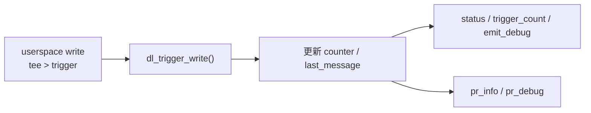

# 01 - debugfs + logging

## 目的

學會比 `printk` 更有紀律的 debug 方式：

- `pr_info`
- `pr_debug`
- `debugfs`
- dynamic debug

## 你會學到什麼

- 建立 debugfs directory 與檔案
- 導出簡單狀態
- 透過 write 觸發 driver 行為
- 用 dynamic debug 精準打開 `pr_debug()`

## 先備理解

這一關的重點不是「多一個檔案系統」，而是你開始學會：

- 不只看 log，也要主動把 driver 狀態導出來
- 把「最後一次發生了什麼」變成可讀資訊
- 把 `pr_debug()` 當成可精準開關的 debug 路徑，而不是永遠打開

## 這一關的心智模型

`trigger` 這個檔案只是入口，真正重要的是它會驅動一段 kernel path：



## 提供的介面

模組載入後會建立：

```text
/sys/kernel/debug/driver_lab_debugfs/
  status
  trigger
  trigger_count
  emit_debug
```

## 使用方式

```sh
make
../../scripts/mount-debugfs.sh
sudo insmod ./driver_lab_debugfs_logging.ko
cat /sys/kernel/debug/driver_lab_debugfs/status
printf '%s' 'first-run' | sudo tee /sys/kernel/debug/driver_lab_debugfs/trigger
cat /sys/kernel/debug/driver_lab_debugfs/status
echo 'module driver_lab_debugfs_logging +p' | sudo tee /proc/dynamic_debug/control
printf '%s' 'second-run' | sudo tee /sys/kernel/debug/driver_lab_debugfs/trigger
sudo rmmod driver_lab_debugfs_logging
```

命令逐行在做什麼：

- `make`：建出 `driver_lab_debugfs_logging.ko`
- `mount-debugfs.sh`：確保 `/sys/kernel/debug` 已掛載
- `insmod`：把這支 lab module 載入 kernel
- 第一次 `cat status`：先看初始狀態
- `tee > trigger`：從 userspace 觸發一次 driver path
- 第二次 `cat status`：觀察 state 是否更新
- `echo ... /proc/dynamic_debug/control`：只打開這個 module 的 `pr_debug()`
- 再次 `tee > trigger`：觀察 dynamic debug 開啟後的差異
- `rmmod`：卸載 module

## 自動化 smoke test

```sh
./test.sh
```

## 驗收標準

- `status` 可讀
- `trigger` 可寫
- `trigger_count` 會增加
- dynamic debug 啟用後，看得到 `pr_debug()` 路徑

## 新手最該觀察什麼

1. `status` 內容在每次 write 前後有沒有變化
2. `trigger_count` 是否真的增加
3. `emit_debug` 變數與 `pr_debug()` 是否對得起來
4. 卸載模組後，`/sys/kernel/debug/driver_lab_debugfs` 是否消失

## 注意

- debugfs 不是正式 ABI
- `trigger` 的 payload 長度目前限制在 63 bytes 內
- 這一關是 `debug interface`，不是產品對外 ABI 設計範例
