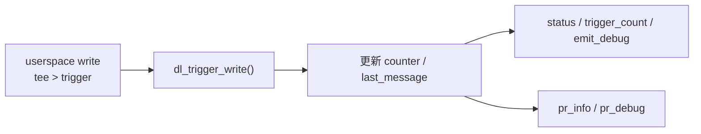

# 01 - debugfs + logging

## 目的

學會比 `printk` 更有紀律的 debug 方式：

- `pr_info`
- `pr_debug`
- `debugfs`
- dynamic debug

## 你會學到什麼

- 建立 debugfs directory 與檔案
- 導出簡單狀態
- 透過 write 觸發 driver 行為
- 用 dynamic debug 精準打開 `pr_debug()`

## 先備理解

如果你剛做完 `00-hello-module`，先讀：

- [`../../docs/onboarding/00-to-01-debugfs-bridge.md`](../../docs/onboarding/00-to-01-debugfs-bridge.md)

這份橋接文件會先解釋 `debugfs`、VFS callback、`struct file`、`struct inode`、`struct seq_file` 和 dynamic debug 的最低心智模型。

這一關的重點不是「多一個檔案系統」，而是你開始學會：

- 不只看 log，也要主動把 driver 狀態導出來
- 把「最後一次發生了什麼」變成可讀資訊
- 把 `pr_debug()` 當成可精準開關的 debug 路徑，而不是永遠打開

第一輪不要求你完整理解 VFS 或 `seq_file`。你只要能把「命令 -> debugfs 檔案 -> driver callback -> kernel state -> 觀測結果」串起來，就可以繼續往下做。

## 這一關的心智模型

`trigger` 這個檔案只是入口，真正重要的是它會驅動一段 kernel path：



> **逐步說明：**
>
> 1. **userspace 寫入 `trigger`**：你用 `printf ... | sudo tee .../trigger` 把一段文字送進 debugfs 檔案。
> 2. **kernel 呼叫 `dl_trigger_write()`**：這個檔案不是普通磁碟檔；driver 登記了 write callback，所以寫入會進 driver。
> 3. **driver 更新狀態**：callback 會更新 `dl_trigger_count` 與 `dl_last_message`。
> 4. **狀態可被讀出**：`status`、`trigger_count`、`emit_debug` 讓你從 userspace 看 kernel state。
> 5. **log 可被觀測**：`pr_info()` 通常會進 `dmesg`；`pr_debug()` 需要 dynamic debug 開啟後才容易看到。
>
> **白話總結**：`trigger` 像一個測試按鈕，按下去後 driver 更新內部狀態；`status` 像狀態面板，讓你確認按鈕真的生效。

## 提供的介面

模組載入後會建立：

```text
/sys/kernel/debug/driver_lab_debugfs/
  status
  trigger
  trigger_count
  emit_debug
```

## 使用方式

```sh
make
../../scripts/mount-debugfs.sh
sudo insmod ./driver_lab_debugfs_logging.ko
cat /sys/kernel/debug/driver_lab_debugfs/status
printf '%s' 'first-run' | sudo tee /sys/kernel/debug/driver_lab_debugfs/trigger
cat /sys/kernel/debug/driver_lab_debugfs/status
echo 'module driver_lab_debugfs_logging +p' | sudo tee /proc/dynamic_debug/control
printf '%s' 'second-run' | sudo tee /sys/kernel/debug/driver_lab_debugfs/trigger
sudo rmmod driver_lab_debugfs_logging
```

命令逐行在做什麼：

- `make`：建出 `driver_lab_debugfs_logging.ko`
- `mount-debugfs.sh`：確保 `/sys/kernel/debug` 已掛載
- `insmod`：把這支 lab module 載入 kernel
- 第一次 `cat status`：先看初始狀態
- `tee > trigger`：從 userspace 觸發一次 driver path
- 第二次 `cat status`：觀察 state 是否更新
- `echo ... /proc/dynamic_debug/control`：只打開這個 module 的 `pr_debug()`
- 再次 `tee > trigger`：觀察 dynamic debug 開啟後的差異
- `rmmod`：卸載 module

## `test.sh` 逐段在做什麼

`test.sh` 不是另一套新概念，它只是把 README 的手動步驟自動跑一次。

| 片段 | 第一輪理解 |
|---|---|
| `if [ "$(uname -s)" != "Linux" ]` | macOS 不能載入 Linux kernel module，所以先擋掉錯誤環境。 |
| `"$ROOT_DIR/scripts/mount-debugfs.sh"` | 確保 `/sys/kernel/debug` 存在，否則後面看不到 debugfs 檔案。 |
| `make` | 建出 `driver_lab_debugfs_logging.ko`。 |
| `lsmod ... rmmod` | 如果前一次測試留下同名 module，先卸載，避免 `insmod` 卡住。 |
| `insmod` | 載入 module，讓 `driver_lab_debugfs_logging_init()` 建立 debugfs 檔案。 |
| `cat .../status` | 讀取 driver 導出的狀態文字。 |
| `tee .../trigger` | 寫入 debugfs 檔案，觸發 `dl_trigger_write()`。 |
| `cat .../trigger_count` | 確認 trigger counter 有被更新。 |
| `dmesg ... grep` | 從 kernel log 確認 module 有輸出。 |
| `rmmod` / `make clean` | 卸載 module 並清掉 build artifact。 |

dynamic debug 那段：

```sh
if [ -e /proc/dynamic_debug/control ]; then
	echo 'module driver_lab_debugfs_logging +p' | $SUDO tee /proc/dynamic_debug/control >/dev/null
	printf '%s' 'smoke-two' | $SUDO tee /sys/kernel/debug/driver_lab_debugfs/trigger >/dev/null
fi
```

逐行看：

- `if [ -e /proc/dynamic_debug/control ]`：這顆 kernel 有 dynamic debug 才跑。沒有這個檔案就跳過，不代表 lab 壞掉。
- `module driver_lab_debugfs_logging +p`：只打開 `driver_lab_debugfs_logging` 這個 module 裡的 `pr_debug()` print flag。
- `tee /proc/dynamic_debug/control`：把控制命令交給 kernel dynamic debug 機制。
- 再寫一次 `trigger`：讓 `dl_trigger_write()` 再跑一次，這次 `pr_debug()` 有機會進 log。

第一輪你不用背 dynamic debug 的完整 query language。先記住：`pr_info()` 通常直接可見，`pr_debug()` 通常要被打開才看得到。

## 自動化 smoke test

```sh
./test.sh
```

## 驗收標準

- `status` 可讀
- `trigger` 可寫
- `trigger_count` 會增加
- dynamic debug 啟用後，看得到 `pr_debug()` 路徑

## 第一輪閱讀界線

| 分類 | 內容 |
|---|---|
| 第一輪必懂 | debugfs 是 debug 觀測入口；寫 `trigger` 會進 `dl_trigger_write()`；讀 `status` 會走到 `dl_status_show()`；`pr_debug()` 可用 dynamic debug 選擇性打開。 |
| 可以先略過 | `struct inode`、`struct file`、`struct seq_file` 的完整內部結構；dynamic debug query language 的完整語法。 |
| 之後再回來補 | VFS 如何管理 open file lifetime；`seq_file` 如何處理多段輸出；debugfs API 在大型 driver 裡的目錄設計。 |

## 完成後你應該能回答

| 問題 | 標準答案 |
|---|---|
| 這一關的入口在哪裡？ | module 載入入口是 `driver_lab_debugfs_logging_init()`；userspace 觸發 driver 行為的入口是寫入 debugfs 的 `trigger` 檔案。 |
| debugfs 在這裡扮演什麼角色？ | debugfs 是 debug / 觀測介面，不是穩定產品 ABI；它適合導出狀態與暫時 debug knob。 |
| 第一個觀測點是什麼？ | `/sys/kernel/debug/driver_lab_debugfs/status`、`trigger_count`、`emit_debug`，以及 `dmesg` 裡的 module log。 |
| 這一關主要拿到什麼 resource？ | debugfs directory 與多個 debugfs files。 |
| cleanup 做了什麼？ | module 卸載時移除 debugfs 目錄與底下檔案，避免留下 stale debug entry。 |
| 失敗時第一個看哪裡？ | 先確認 `/sys/kernel/debug` 是否已掛載，再看 `sudo dmesg | tail -n 50`。 |

## 新手最該觀察什麼

1. `status` 內容在每次 write 前後有沒有變化
2. `trigger_count` 是否真的增加
3. `emit_debug` 變數與 `pr_debug()` 是否對得起來
4. 卸載模組後，`/sys/kernel/debug/driver_lab_debugfs` 是否消失

## 如果你完全看不懂 source code，先看哪 5 行

先不要從 `#include` 或 struct 定義開始。直接找這 5 個位置：

1. `debugfs_create_dir(DL_DEBUGFS_DIR_NAME, NULL)`：建立 `/sys/kernel/debug/driver_lab_debugfs` 目錄。
2. `debugfs_create_file("status", 0444, dl_root, NULL, &dl_status_fops)`：建立可讀的 `status` 檔。
3. `debugfs_create_file("trigger", 0200, dl_root, NULL, &dl_trigger_fops)`：建立可寫的 `trigger` 檔。
4. `dl_trigger_write()`：寫 `trigger` 後，counter 和 last message 在這裡更新。
5. `dl_status_show()`：讀 `status` 時，輸出的文字在這裡產生。

如果這 5 個位置能對上 README 的命令，你就已經抓到 `01` 的主線。

## 這些 struct 第一輪怎麼理解

| 名稱 | 第一輪理解 | 現在要深入嗎 |
|---|---|---|
| `struct dentry` | debugfs 目錄或檔案在 kernel 裡的代表物件。`dl_root` 用來記住根目錄，卸載時才能移除。 | 不需要 |
| `struct inode` | VFS 傳給 open callback 的檔案節點資訊。這一關只把它交給 `single_open()`。 | 不需要 |
| `struct file` | VFS 傳給 read/write/open callback 的開啟檔案物件。這一關只需要知道 callback 會收到它。 | 不需要 |
| `struct seq_file` | kernel 用來產生可被 `cat` 讀取的文字輸出 helper。`seq_printf()` 會把文字放進這個輸出流程。 | 只需知道用途 |
| `struct file_operations` | 一張 callback 表，告訴 kernel 讀寫 debugfs 檔案時要呼叫哪些 driver 函式。 | 需要知道用途 |

## 看 source code 時先抓哪幾個點

第一次不要從 include 或每個 helper 開始背。先照這個順序看：

1. `driver_lab_debugfs_logging_init()`：module 載入後建立哪些 debugfs 檔案
2. `dl_trigger_write()`：userspace 寫入 `trigger` 後，kernel state 怎麼被更新
3. `dl_status_show()`：`cat status` 時，driver 如何把 kernel state 轉成文字
4. `dl_status_fops` / `dl_trigger_fops`：debugfs 檔案如何接到 read/write callback
5. `driver_lab_debugfs_logging_exit()`：卸載時 debugfs 目錄如何被移除

遇到 kernel API 時，先套用「參數角色」模板，不要一開始追 debugfs / VFS 內部。完整方法見 [`../../docs/onboarding/kernel-api-parameter-roles.md`](../../docs/onboarding/kernel-api-parameter-roles.md)。

| API | 參數角色 | 第一輪理解 |
|---|---|---|
| `debugfs_create_dir("driver_lab_debugfs", NULL)` | 名字、parent | 建立 debugfs 目錄；`NULL` parent 表示掛在 debugfs root。 |
| `debugfs_create_file("status", 0444, dl_root, NULL, &dl_status_fops)` | 檔名、權限、父目錄、private data、callback table | `cat status` 會依 `dl_status_fops` 走到 `single_open()` / `dl_status_show()`。 |
| `debugfs_create_u32("emit_debug", 0644, dl_root, &dl_emit_debug)` | 檔名、權限、父目錄、value pointer | debugfs 直接讀寫 `dl_emit_debug` 這個 kernel 變數。 |
| `copy_from_user(local, buf, copy_len)` | destination、source、size | 把 userspace 寫入 `trigger` 的 payload 複製到 kernel stack buffer。 |
| `single_open(file, dl_status_show, inode->i_private)` | opened file、show callback、private data | 把 `cat status` 的輸出接到 `dl_status_show()`。 |

這一關的重點不是 debugfs API 背誦，而是建立「driver 要有可觀測狀態」的習慣。

## 注意

- debugfs 不是正式 ABI
- `trigger` 的 payload 長度目前限制在 63 bytes 內
- 這一關是 `debug interface`，不是產品對外 ABI 設計範例
