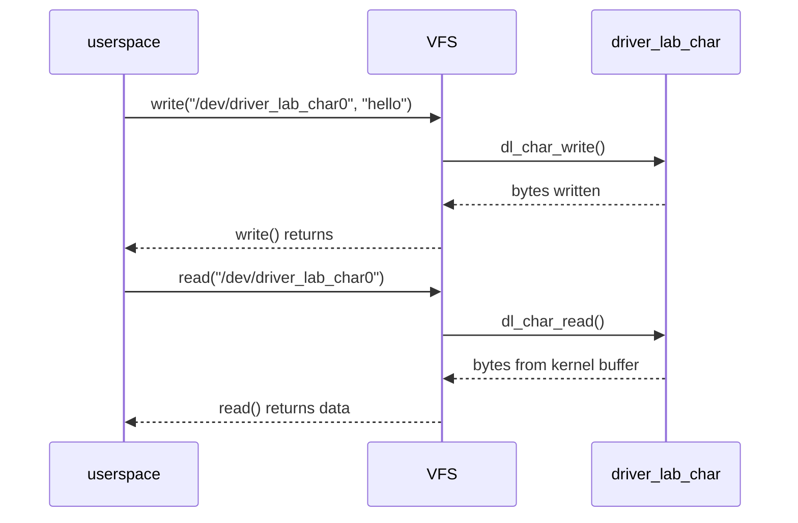

# 02 - Char Device

## 目的

建立最小的 user-kernel 邊界：

- 建立 `/dev/...`
- 實作 `open`
- 實作 `read`
- 實作 `write`

這一關會讓你開始從「只會 load module」進入「driver 對 userspace 提供介面」。

## 你會學到什麼

- `alloc_chrdev_region`
- `cdev_init` / `cdev_add`
- `class_create`
- `device_create`
- `copy_to_user` / `copy_from_user`
- 最小 resource cleanup path

## 先備理解

這一關開始，你不再只是「load 一個 module」。

你要開始理解：

- `/dev/driver_lab_char0` 是 driver 暴露給 userspace 的入口
- user space 的 `write()` 最後會走到你的 `.write` callback
- user space 的 `read()` 最後會走到你的 `.read` callback

## 這一關的資料流



> **逐步說明：**
>
> 1. **userspace 寫入 device node**：`tee /dev/driver_lab_char0` 不是寫普通檔案，而是對 char device 做 `write()`。
> 2. **VFS 分派到 driver**：kernel 透過 major/minor 與 `cdev` 找到 `dl_char_fops`，再呼叫 `.write` 指向的 `dl_char_write()`。
> 3. **driver 更新 kernel buffer**：`dl_char_write()` 用 `copy_from_user()` 把 userspace 字串複製進 driver 維護的 buffer。
> 4. **userspace 讀回資料**：`dd if=/dev/driver_lab_char0` 觸發 `read()`，VFS 再呼叫 `dl_char_read()`。
> 5. **driver 回傳 buffer**：`dl_char_read()` 用 `copy_to_user()` 把 kernel buffer 複製回 userspace。
>
> **白話總結**：`/dev/driver_lab_char0` 像一個櫃台窗口，寫入是把資料交給 driver，讀取是請 driver 把目前保存的資料拿回來。

## 提供的裝置

```text
/dev/driver_lab_char0
```

## 這一關會出現哪些 filesystem 入口

讀這關前建議先看：

- [`../../docs/onboarding/kernel-filesystem-surfaces.md`](../../docs/onboarding/kernel-filesystem-surfaces.md)

第一輪要分清楚這幾個路徑不是同一件事：

| 路徑 | 誰讓它出現 | 第一輪用途 |
|---|---|---|
| `/dev/driver_lab_char0` | `device_create()` 建立 device object 後，通常由 devtmpfs 建立，udev 可能再調整 | userspace 對 driver 做 `read/write` 的操作入口 |
| `/sys/class/driver_lab_char` | `class_create(DL_CHAR_CLASS_NAME)` | 觀察 device class 是否建立成功 |
| `/sys/class/driver_lab_char/driver_lab_char0` | `device_create(..., DL_CHAR_DEVICE_NAME)` | 觀察 device object 是否掛到 class 底下 |
| `/sys/devices/virtual/driver_lab_char/driver_lab_char0` | kernel device model | 很多系統上 `/sys/class/.../driver_lab_char0` 會指到這裡 |
| `/proc/devices` | `alloc_chrdev_region()` 註冊 major/minor 名稱 | 輔助確認 `driver_lab_char` 的 device number 註冊 |

你可以這樣驗證：

```sh
ls -l /dev/driver_lab_char0
ls -l /sys/class/driver_lab_char/driver_lab_char0
cat /sys/class/driver_lab_char/driver_lab_char0/dev
grep driver_lab_char /proc/devices
```

如果 `/sys/class/driver_lab_char/driver_lab_char0` 顯示成 symlink，不是錯誤。`/sys/class` 是 class 視角，實際 device 常在 `/sys/devices/virtual/...`。

## Kernel API 參數第一輪怎麼讀

讀這一關的 source code 前，先看：

- [`../../docs/onboarding/kernel-api-parameter-roles.md`](../../docs/onboarding/kernel-api-parameter-roles.md)

第一輪不要背 API，而是問：

```text
這個 API 產生什麼 resource？
哪些參數是 input？
哪些參數是 output？
成功後下一步誰會用？
失敗時要釋放什麼？
```

### 四個核心 resource

| 變數 | 第一輪理解 | 白話記法 |
|---|---|---|
| `dl_char_devt` | device number，包含 major/minor | 門牌號碼 |
| `dl_char_cdev` | char device object，接上 `file_operations` | 櫃台本體 |
| `dl_char_class` | device model class，給 `device_create()` 使用 | 分類資料夾 |
| `dl_char_device` | 實際 device object，對應 `/dev/driver_lab_char0` | userspace 看得到的入口 |

### init 是一條 resource pipeline

```text
alloc_chrdev_region()
    產生 dl_char_devt
          ↓
cdev_init()
    把 dl_char_cdev 和 dl_char_fops 接起來
          ↓
cdev_add()
    把 cdev 註冊到 dl_char_devt
          ↓
class_create()
    產生 dl_char_class
          ↓
device_create()
    用 class + dev_t + name 建出 sysfs device entry
          ↓
devtmpfs / udev
    讓 /dev/driver_lab_char0 出現或調整權限
```

### 參數角色表

| API | 主要參數 | 角色 | 本 lab 的值 | 成功後誰會用 |
|---|---|---|---|---|
| `alloc_chrdev_region()` | `&dl_char_devt` | output，kernel 填入 major/minor | global `dev_t` | `cdev_add()`、`device_create()` |
| `alloc_chrdev_region()` | `0` | input，起始 minor | minor 0 | 這關只有一個 device |
| `alloc_chrdev_region()` | `1` | input，申請數量 | 1 個 device number | `cdev_add(..., 1)` |
| `alloc_chrdev_region()` | `DL_CHAR_CLASS_NAME` | input，註冊名字 | `driver_lab_char` | log / `/proc/devices` 輔助辨識 |
| `cdev_init()` | `&dl_char_cdev` | 要初始化的 cdev object | global `struct cdev` | `cdev_add()` |
| `cdev_init()` | `&dl_char_fops` | callback table | `.open/.read/.write/.release` | VFS 分派 callback |
| `cdev_add()` | `dl_char_devt` | 前一步拿到的 major/minor | `dl_char_devt` | VFS 用它找到 cdev |
| `class_create()` | `DL_CHAR_CLASS_NAME` | class 名字 | `driver_lab_char` | `device_create()` |
| `device_create()` | `dl_char_class` | 前一步建立的 class | `dl_char_class` | 決定 device 掛在哪個 class |
| `device_create()` | `NULL` parent | parent device | 這關沒有上層硬體 | 可先略過 |
| `device_create()` | `dl_char_devt` | device number | major/minor | `/dev` node 對應的編號 |
| `device_create()` | `NULL` drvdata | driver private data | 這關沒用 | 進階 driver 才常用 |
| `device_create()` | `DL_CHAR_DEVICE_NAME` | device 名字 | `driver_lab_char0` | sysfs device entry 與 `/dev/driver_lab_char0` 的名字 |

### read/write 的方向

| API | 方向 | 第一輪記法 |
|---|---|---|
| `simple_write_to_buffer(dl_char_buffer, ..., buf, count)` | user -> kernel | userspace `buf` 是來源，kernel `dl_char_buffer` 是目的地。 |
| `simple_read_from_buffer(buf, count, ..., dl_char_buffer, ...)` | kernel -> user | kernel `dl_char_buffer` 是來源，userspace `buf` 是目的地。 |

這兩個 helper 讓本 lab 不用直接手寫完整 `copy_from_user()` / `copy_to_user()` 流程，但你仍要理解方向：

```text
write: user buffer -> kernel buffer
read:  kernel buffer -> user buffer
```

### 回傳值怎麼看

| API 類型 | 例子 | 判斷方式 |
|---|---|---|
| 回傳 `int` | `alloc_chrdev_region()`、`cdev_add()` | `0` 成功，負 errno 失敗，所以 code 用 `if (ret)`。 |
| 回傳 pointer 或 error pointer | `class_create()`、`device_create()` | 用 `IS_ERR()` 判斷失敗，用 `PTR_ERR()` 取出錯誤碼。 |
| 回傳 byte count | `simple_read_from_buffer()`、`simple_write_to_buffer()` | 正數代表處理幾個 byte，負數代表錯誤。 |

### cleanup 配對

| init 拿到 | exit / error path 釋放 |
|---|---|
| `alloc_chrdev_region()` | `unregister_chrdev_region()` |
| `cdev_add()` | `cdev_del()` |
| `class_create()` | `class_destroy()` |
| `device_create()` | `device_destroy()` |

第一輪請把 error label 唸成：

```text
目前已經成功拿到哪些 resource？
從最後拿到的開始反向釋放。
```

## 手動操作

```sh
make
sudo insmod ./driver_lab_char.ko
printf '%s' 'hello-from-userspace' | sudo tee /dev/driver_lab_char0 >/dev/null
sudo dd if=/dev/driver_lab_char0 bs=1 count=20 status=none
sudo rmmod driver_lab_char
make clean
```

命令逐行在做什麼：

- `make`：建出 `driver_lab_char.ko`
- `insmod`：載入 char device module
- `tee /dev/driver_lab_char0`：把字串寫進 driver 的 kernel buffer
- `dd if=/dev/driver_lab_char0 ...`：再從 device node 把資料讀回來
- `rmmod`：卸載 module
- `make clean`：刪掉建置產物

## 自動化 smoke test

```sh
./test.sh
```

`test.sh` 逐段在驗什麼：

1. 確認目前是 Linux，因為 macOS 不能載入 Linux kernel module。
2. `make` 建出 `driver_lab_char.ko`。
3. 如果前一次測試留下同名 module，先 `rmmod` 清掉。
4. `insmod` 載入 module，讓 `/dev/driver_lab_char0` 出現。
5. 用 `tee` 寫入固定字串，再用 `dd` 讀回同樣長度。
6. 用 `diff -u` 比對 expected/readback，確認 data path 沒跑偏。
7. 用 `dmesg | grep driver_lab_char` 確認 kernel log 有本 lab 訊息。
8. `rmmod` 與 `make clean` 收尾。

第一輪看不懂 shell 細節沒關係，先抓住它在驗「write 進 driver，再 read 回來」。

## user-space runtime

這個 lab 搭配：

- [`../../runtime/README.md`](../../runtime/README.md)
- [`../../tests/driver_lab_char_cli.c`](../../tests/driver_lab_char_cli.c)

編譯 CLI：

```sh
cd ../../runtime
make
../tests/driver_lab_char_cli /dev/driver_lab_char0 write hello-runtime
../tests/driver_lab_char_cli /dev/driver_lab_char0 read
```

## 驗收標準

- `/dev/driver_lab_char0` 存在
- 可成功 write
- 可成功 read
- unload 時沒有 resource 洩漏或明顯錯誤

## 第一輪閱讀界線

| 分類 | 內容 |
|---|---|
| 第一輪必懂 | `/dev/driver_lab_char0` 是 userspace 入口；`write()` 會進 `dl_char_write()`；`read()` 會進 `dl_char_read()`；init 拿到的 device resource 要在 exit 反向釋放。 |
| 可以先略過 | `struct inode` / `struct file` 的完整內容；udev/devtmpfs 建立 device node 的完整流程；major/minor 編號管理的所有細節。 |
| 之後再回來補 | `cdev` lifetime、device class 與 sysfs 的關係、同一個 device 被多個 process 同時開啟時的語意。 |

## 完成後你應該能回答

| 問題 | 標準答案 |
|---|---|
| userspace 的入口在哪裡？ | `/dev/driver_lab_char0`；對它做 `read()` / `write()` 會經過 VFS 轉到 driver 的 `file_operations` callback。 |
| `.read` / `.write` 分別接到哪裡？ | `.read` 接到 `dl_char_read()`，`.write` 接到 `dl_char_write()`。 |
| 第一個觀測點是什麼？ | 寫入 `/dev/driver_lab_char0` 後讀回資料，並用 `dmesg` 觀察 `driver_lab_char` log。 |
| 這一關主要拿到什麼 resource？ | major/minor device number、`cdev`、`class`、`device`；`device_create()` 後會有 sysfs entry，`/dev/driver_lab_char0` 通常由 devtmpfs 建立並可能由 udev 調整。 |
| cleanup 要釋放哪些東西？ | `device_destroy()`、`class_destroy()`、`cdev_del()`、`unregister_chrdev_region()`，順序要大致反向於 init 拿資源的順序。 |
| `/dev/driver_lab_char0` 沒出現時第一個看哪裡？ | 先看 `sudo dmesg | tail -n 50`，再查 `lsmod`、`ls -l /sys/class/driver_lab_char/driver_lab_char0` 與 `ls -l /dev/driver_lab_char0`。 |

## 目前這支 driver 的刻意簡化

- 每次 write 都會覆蓋整個 kernel buffer，不做 append
- read 支援一般檔案式的偏移前進，所以同一個 fd 讀到 EOF 後，再讀一次會得到 `0`
- 這是教學用最小模型，不是完整產品級 char driver

## 看 source code 時先抓哪幾個點

第一次讀 code 時，先把「userspace 檔案操作怎麼進 driver」串起來：

1. `driver_lab_char_init()`：如何取得 major/minor，並建立 `/dev/driver_lab_char0`
2. `dl_char_fops`：VFS 看到 `.read` / `.write` 時，會呼叫哪個 driver callback
3. `dl_char_write()`：資料怎麼從 userspace 複製進 kernel buffer
4. `dl_char_read()`：資料怎麼從 kernel buffer 複製回 userspace
5. `dl_char_lock`：為什麼 read/write 共享同一份 buffer 時需要 lock
6. `driver_lab_char_exit()`：cleanup 是否跟 init 拿資源的順序相反

遇到 kernel API 時，先套用「參數角色」模板：input、output、前一步 resource、數量、名字、callback table、userspace pointer、cleanup 對象。第一輪不用追 API 內部。

先不要追 `struct inode` 或 `struct file` 的完整定義。你只需要知道它們是 VFS 傳進 callback 的上下文。

## 目前限制

- 還沒有 `ioctl`
- 還沒有 `poll`
- 還沒有 `mmap`
- buffer 固定 256 bytes

下一步是 [`../03-ioctl-poll-mmap`](../03-ioctl-poll-mmap)
