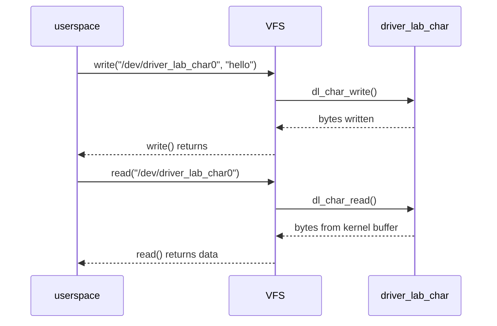

# 02 - Char Device

## 目的

建立最小的 user-kernel 邊界：

- 建立 `/dev/...`
- 實作 `open`
- 實作 `read`
- 實作 `write`

這一關會讓你開始從「只會 load module」進入「driver 對 userspace 提供介面」。

## 你會學到什麼

- `alloc_chrdev_region`
- `cdev_init` / `cdev_add`
- `class_create`
- `device_create`
- `copy_to_user` / `copy_from_user`
- 最小 resource cleanup path

## 先備理解

這一關開始，你不再只是「load 一個 module」。

你要開始理解：

- `/dev/driver_lab_char0` 是 driver 暴露給 userspace 的入口
- user space 的 `write()` 最後會走到你的 `.write` callback
- user space 的 `read()` 最後會走到你的 `.read` callback

## 這一關的資料流



## 提供的裝置

```text
/dev/driver_lab_char0
```

## 手動操作

```sh
make
sudo insmod ./driver_lab_char.ko
printf '%s' 'hello-from-userspace' | sudo tee /dev/driver_lab_char0 >/dev/null
sudo dd if=/dev/driver_lab_char0 bs=1 count=20 status=none
sudo rmmod driver_lab_char
make clean
```

命令逐行在做什麼：

- `make`：建出 `driver_lab_char.ko`
- `insmod`：載入 char device module
- `tee /dev/driver_lab_char0`：把字串寫進 driver 的 kernel buffer
- `dd if=/dev/driver_lab_char0 ...`：再從 device node 把資料讀回來
- `rmmod`：卸載 module
- `make clean`：刪掉建置產物

## 自動化 smoke test

```sh
./test.sh
```

## user-space runtime

這個 lab 搭配：

- [`../../runtime/README.md`](../../runtime/README.md)
- [`../../tests/driver_lab_char_cli.c`](../../tests/driver_lab_char_cli.c)

編譯 CLI：

```sh
cd ../../runtime
make
../tests/driver_lab_char_cli /dev/driver_lab_char0 write hello-runtime
../tests/driver_lab_char_cli /dev/driver_lab_char0 read
```

## 驗收標準

- `/dev/driver_lab_char0` 存在
- 可成功 write
- 可成功 read
- unload 時沒有 resource 洩漏或明顯錯誤

## 目前這支 driver 的刻意簡化

- 每次 write 都會覆蓋整個 kernel buffer，不做 append
- read 支援一般檔案式的偏移前進，所以同一個 fd 讀到 EOF 後，再讀一次會得到 `0`
- 這是教學用最小模型，不是完整產品級 char driver

## 看 source code 時先抓哪幾個點

1. `driver_lab_char_init()`：如何註冊 major/minor、class、device
2. `dl_char_write()`：資料怎麼從 userspace 進 kernel buffer
3. `dl_char_read()`：資料怎麼從 kernel buffer 回 userspace
4. `driver_lab_char_exit()`：cleanup 是否跟 init 對稱

## 目前限制

- 還沒有 `ioctl`
- 還沒有 `poll`
- 還沒有 `mmap`
- buffer 固定 256 bytes

下一步是 [`../03-ioctl-poll-mmap`](../03-ioctl-poll-mmap)
