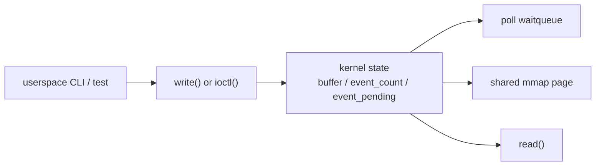

# 03 - ioctl / poll / mmap

## 目標

把 `02-char-device` 的最小字元裝置，升級成比較像真正 driver ABI 的版本。

## 先備條件

- 你已經理解 `02-char-device` 的 `read/write`
- 你知道 `/dev/...` 背後是 `file_operations`
- 你已經能用自己的話解釋 userspace -> VFS -> driver callback

## 這一關要補的能力

- `ioctl` 命令編號設計
- `poll` / waitqueue
- blocking vs non-blocking path
- 基本 `mmap`
- runtime library 擴充

## 建議輸出

- kernel module
- user-space runtime API
- CLI / smoke test
- 邊界條件測試

## 這一關現在已實作的介面

module 載入後會建立：

```text
/dev/driver_lab_ctl0
```

## 這一關會出現哪些 filesystem 入口

`03` 沿用 `02` 的 char device 建立流程，只是 callback 變多。若你忘了 `/dev`、`/sys/class`、devtmpfs/udev 的分工，先回頭看 [`../../docs/onboarding/kernel-filesystem-surfaces.md`](../../docs/onboarding/kernel-filesystem-surfaces.md)。

| 路徑 | 第一輪用途 |
|---|---|
| `/dev/driver_lab_ctl0` | userspace 對 `read/write/ioctl/poll/mmap` 的主要操作入口。 |
| `/sys/class/driver_lab_ctl/driver_lab_ctl0` | 確認 `class_create()` / `device_create()` 已建立 device model entry。 |
| `/sys/devices/virtual/driver_lab_ctl/driver_lab_ctl0` | 很多系統上 `/sys/class/...` 會指向的實際 virtual device 位置。 |
| `/proc/devices` | 輔助確認 `driver_lab_ctl` 的 major number 已註冊。 |

`mmap()` 不是建立一個新的檔案路徑；它是把 driver 維護的一頁 memory 映射進目前 process 的 address space。

這個 device node 目前支援：

- `read/write`
- `ioctl`
- `poll`
- `mmap`

## 這一關的 ABI

### `write()`

- 把 userspace 字串直接寫進 kernel buffer
- 每次 write 都會覆蓋前一次訊息

### `read()`

- 從 kernel buffer 讀回目前訊息
- 這一關的 `read()` 是消費型語意：完整讀完一次後，buffer 會被清空
- 如果 buffer 為空：
  - blocking fd 會等待
  - non-blocking fd 會回 `-EAGAIN`

### `ioctl`

共用 header：

- [`../../runtime/include/driver_lab_uapi.h`](../../runtime/include/driver_lab_uapi.h)

目前支援：

- `DL_IOC_SET_MESSAGE`
- `DL_IOC_GET_STATUS`
- `DL_IOC_TRIGGER_EVENT`
- `DL_IOC_CLEAR_BUFFER`

### `poll`

- `poll()` 會等待：
  - 有可讀資料
  - 或 driver event 被 trigger

### `mmap`

- 映射一頁 shared page 到 userspace
- 裡面放的是：
  - magic
  - version
  - event count
  - event pending
  - buffer length
  - buffer 內容

## 資料流



> **逐步說明：**
>
> 1. **CLI 發出不同操作**：同一支 CLI 可能呼叫 `write()`、`ioctl()`、`poll()` 或 `mmap()`。
> 2. **driver 更新共享狀態**：不管是寫入訊息或觸發 event，最後都會改到 `buffer`、`event_count`、`event_pending` 這類 kernel state。
> 3. **`read()` 讀 data path**：userspace 透過 `read()` 把目前 buffer 取回，這是最像 `02` 的路徑。
> 4. **`poll()` 等 event path**：如果目前沒有資料或事件，userspace 可以睡著等 driver 喚醒，不需要一直輪詢。
> 5. **`mmap()` 看 shared page**：userspace 讀到的是 driver 維護的一頁 snapshot，不是任意 kernel memory。
>
> **白話總結**：`03` 像把同一個櫃台分成資料、控制、等待通知、公告欄四種服務；入口一樣是 device node，但用途變多了。

## 成功標準

- userspace 能透過 `ioctl` 控制 driver
- `poll` 能等待事件
- `mmap` 能暴露一塊受控 buffer
- README 有清楚描述 ABI

## 使用方式

```sh
make
make -C ../../runtime
sudo insmod ./driver_lab_ioctl_poll_mmap.ko
../../tests/driver_lab_char_cli /dev/driver_lab_ctl0 ioctl-write hello-03
../../tests/driver_lab_char_cli /dev/driver_lab_ctl0 status
../../tests/driver_lab_char_cli /dev/driver_lab_ctl0 read
../../tests/driver_lab_char_cli /dev/driver_lab_ctl0 mmap-read
../../tests/driver_lab_char_cli /dev/driver_lab_ctl0 poll 3000
../../tests/driver_lab_char_cli /dev/driver_lab_ctl0 trigger
sudo rmmod driver_lab_ioctl_poll_mmap
```

命令逐行在做什麼：

- `make`：建出 `driver_lab_ioctl_poll_mmap.ko`
- `make -C ../../runtime`：重建 userspace runtime 與 CLI
- `insmod`：載入這支 week-3 lab module
- `ioctl-write`：改用 `ioctl` 而不是純 `write` 來設定訊息
- `status`：讀回目前 driver 狀態
- `read`：從 device node 讀回 kernel buffer
- `mmap-read`：直接從 shared page 觀察 driver 狀態
- `poll`：等待 driver event
- `trigger`：主動觸發一個 event 來喚醒 poll
- `rmmod`：卸載 module

## 自動化 smoke test

```sh
./test.sh
```

`test.sh` 逐段在驗什麼：

1. 確認目前是 Linux，並進入本 lab 目錄。
2. `make` 建 module，`make -C ../../runtime` 建 userspace runtime 與 CLI。
3. 若前一次留下 module，先卸載，避免 device node 狀態混亂。
4. `insmod` 載入 `driver_lab_ioctl_poll_mmap.ko`。
5. `ioctl-write hello-ioctl` 驗 control path 可以設定訊息。
6. `status` 驗 `DL_IOC_GET_STATUS` 能回報 driver 狀態。
7. `read` 驗 data path 能讀回剛設定的訊息。
8. `mmap-read` 驗 shared page 可被 userspace 讀到。
9. 背景啟動 `poll 3000`，主流程再 `trigger`，確認 waitqueue event path 真的會醒。
10. `clear`、`rmmod`、`make clean` 收尾。

第一輪重點不是 shell 技巧，而是確認四條 ABI 路徑都有被跑到。

## 第一輪閱讀界線

| 分類 | 內容 |
|---|---|
| 第一輪必懂 | `03` 把 `02` 的 read/write 擴成四條路：data path、control path、event path、shared memory path；每條路都有對應 CLI subcommand 可觀測。 |
| 可以先略過 | `_IOW/_IOR` macro 的所有位元編碼細節；`poll_table` 內部；page fault 與 VMA 的完整 memory-management 流程。 |
| 之後再回來補 | ABI versioning、blocking/non-blocking 的完整錯誤語意、runtime 如何把 ioctl/poll/mmap 包成穩定 API。 |

## 完成後你應該能回答

| 問題 | 標準答案 |
|---|---|
| 這一關的 userspace 入口在哪裡？ | `/dev/driver_lab_ctl0`；同一個 device node 同時提供 `read/write`、`ioctl`、`poll`、`mmap`。 |
| data path 是什麼？ | `write()` 更新 driver buffer，`read()` 從 driver buffer 讀回資料。 |
| control path 是什麼？ | `ioctl` command，例如 `DL_IOC_SET_MESSAGE`、`DL_IOC_GET_STATUS`、`DL_IOC_TRIGGER_EVENT`、`DL_IOC_CLEAR_BUFFER`。 |
| event path 是什麼？ | `poll()` 透過 waitqueue 等待可讀資料或 pending event，不需要 userspace busy loop。 |
| shared memory path 是什麼？ | `mmap()` 映射 driver 維護的一頁 shared page，userspace 可讀到 magic、event count、buffer snapshot。 |
| 這一關主要拿到什麼 resource？ | char device resource、waitqueue、共享狀態 buffer，以及一頁用來 mmap 的 shared page。 |
| cleanup 要釋放哪些東西？ | 先移除 `/dev`/class/cdev/major-minor，再 `free_page()` 釋放 shared page。 |
| `poll` 沒醒時第一個看哪裡？ | 先確認是否真的執行了 `trigger` 或寫入資料，再看 `dmesg` 與 `driver_lab_char_cli ... status`。 |

## 新手先記住這一關在補什麼

- `read/write` 不夠時，要用 `ioctl` 放控制命令
- 如果 userspace 要等事件，不應一直 busy loop，要有 `poll`
- 如果資料量變大，可能不想每次都 `copy_to_user` / `copy_from_user`，這時才會碰到 `mmap`

## 看 source code 時先抓哪幾個點

這一關內容比 `02` 多很多，不建議第一次逐行硬讀。先把它拆成四條路徑：

1. `driver_lab_ioctl_poll_mmap_init()`：建立 `/dev/driver_lab_ctl0` 與 shared page
2. `dl_fops`：確認 `read/write/ioctl/poll/mmap` 分別接到哪個 callback
3. `dl_publish_message_locked()`：所有寫入與事件觸發最後如何更新同一份 kernel state
4. `dl_unlocked_ioctl()`：control path 如何依 `cmd` 分派不同動作
5. `dl_poll()`：userspace 等事件時，driver 如何把 waitqueue 接進來
6. `dl_mmap()`：userspace 如何看到一頁由 driver 維護的 shared page
7. `driver_lab_ioctl_poll_mmap_exit()`：device node、cdev、class、page 如何被清掉

讀這關時要一直問：這個 callback 是 control path、data path、event path，還是 shared memory path？

遇到 kernel API 時，先套用「參數角色」模板，完整方法見 [`../../docs/onboarding/kernel-api-parameter-roles.md`](../../docs/onboarding/kernel-api-parameter-roles.md)。

| API | 參數角色 | 第一輪理解 |
|---|---|---|
| `copy_from_user(&msg, (void __user *)arg, sizeof(msg))` | kernel destination、userspace source、size | `ioctl arg` 是 userspace pointer，必須安全複製進 kernel struct。 |
| `copy_to_user((void __user *)arg, &status, sizeof(status))` | userspace destination、kernel source、size | 把 driver status struct 複製回 userspace。 |
| `poll_wait(file, &dl_read_wq, wait)` | opened file、waitqueue、poll context | 把目前 fd 和 read waitqueue 接起來，之後狀態改變才能喚醒 poll。 |
| `remap_pfn_range(vma, vma->vm_start, pfn, size, ...)` | VMA、userspace address、page frame、size、protection | 把 driver 控制的一頁 shared page 映射到 userspace。 |
| `alloc_chrdev_region()` / `cdev_add()` / `device_create()` | char device resource pipeline | 和 `02` 同一套 `/dev` 建立流程，只是 callback 更多。 |
