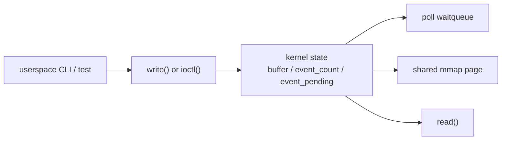

# 03 - ioctl / poll / mmap

## 目標

把 `02-char-device` 的最小字元裝置，升級成比較像真正 driver ABI 的版本。

## 先備條件

- 你已經理解 `02-char-device` 的 `read/write`
- 你知道 `/dev/...` 背後是 `file_operations`
- 你已經能用自己的話解釋 userspace -> VFS -> driver callback

## 這一關要補的能力

- `ioctl` 命令編號設計
- `poll` / waitqueue
- blocking vs non-blocking path
- 基本 `mmap`
- runtime library 擴充

## 建議輸出

- kernel module
- user-space runtime API
- CLI / smoke test
- 邊界條件測試

## 這一關現在已實作的介面

module 載入後會建立：

```text
/dev/driver_lab_ctl0
```

這個 device node 目前支援：

- `read/write`
- `ioctl`
- `poll`
- `mmap`

## 這一關的 ABI

### `write()`

- 把 userspace 字串直接寫進 kernel buffer
- 每次 write 都會覆蓋前一次訊息

### `read()`

- 從 kernel buffer 讀回目前訊息
- 這一關的 `read()` 是消費型語意：完整讀完一次後，buffer 會被清空
- 如果 buffer 為空：
  - blocking fd 會等待
  - non-blocking fd 會回 `-EAGAIN`

### `ioctl`

共用 header：

- [`../../runtime/include/driver_lab_uapi.h`](../../runtime/include/driver_lab_uapi.h)

目前支援：

- `DL_IOC_SET_MESSAGE`
- `DL_IOC_GET_STATUS`
- `DL_IOC_TRIGGER_EVENT`
- `DL_IOC_CLEAR_BUFFER`

### `poll`

- `poll()` 會等待：
  - 有可讀資料
  - 或 driver event 被 trigger

### `mmap`

- 映射一頁 shared page 到 userspace
- 裡面放的是：
  - magic
  - version
  - event count
  - event pending
  - buffer length
  - buffer 內容

## 資料流



## 成功標準

- userspace 能透過 `ioctl` 控制 driver
- `poll` 能等待事件
- `mmap` 能暴露一塊受控 buffer
- README 有清楚描述 ABI

## 使用方式

```sh
make
make -C ../../runtime
sudo insmod ./driver_lab_ioctl_poll_mmap.ko
../../tests/driver_lab_char_cli /dev/driver_lab_ctl0 ioctl-write hello-03
../../tests/driver_lab_char_cli /dev/driver_lab_ctl0 status
../../tests/driver_lab_char_cli /dev/driver_lab_ctl0 read
../../tests/driver_lab_char_cli /dev/driver_lab_ctl0 mmap-read
../../tests/driver_lab_char_cli /dev/driver_lab_ctl0 poll 3000
../../tests/driver_lab_char_cli /dev/driver_lab_ctl0 trigger
sudo rmmod driver_lab_ioctl_poll_mmap
```

命令逐行在做什麼：

- `make`：建出 `driver_lab_ioctl_poll_mmap.ko`
- `make -C ../../runtime`：重建 userspace runtime 與 CLI
- `insmod`：載入這支 week-3 lab module
- `ioctl-write`：改用 `ioctl` 而不是純 `write` 來設定訊息
- `status`：讀回目前 driver 狀態
- `read`：從 device node 讀回 kernel buffer
- `mmap-read`：直接從 shared page 觀察 driver 狀態
- `poll`：等待 driver event
- `trigger`：主動觸發一個 event 來喚醒 poll
- `rmmod`：卸載 module

## 自動化 smoke test

```sh
./test.sh
```

## 新手先記住這一關在補什麼

- `read/write` 不夠時，要用 `ioctl` 放控制命令
- 如果 userspace 要等事件，不應一直 busy loop，要有 `poll`
- 如果資料量變大，可能不想每次都 `copy_to_user` / `copy_from_user`，這時才會碰到 `mmap`
