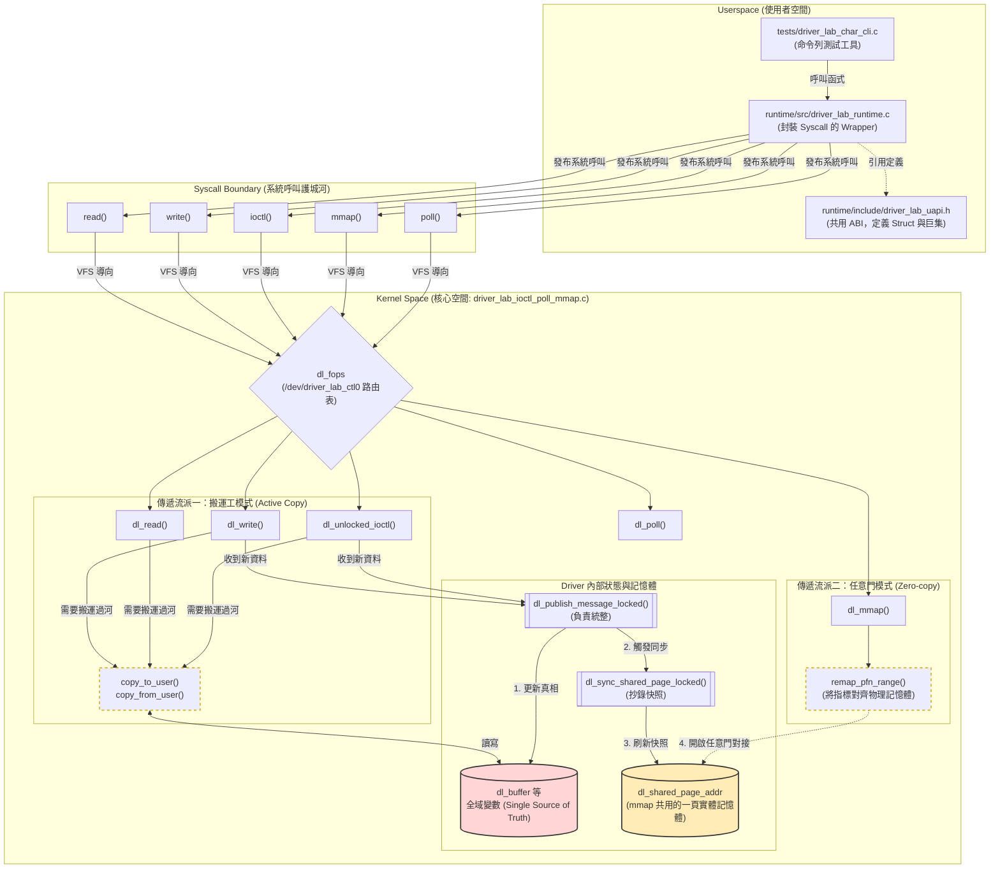
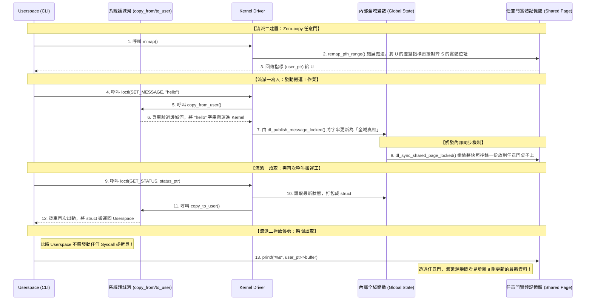

# `driver_lab_ioctl_poll_mmap.c` 詳解

## 結論

`labs/03-ioctl-poll-mmap/driver_lab_ioctl_poll_mmap.c` 是 Lab03 的 kernel module 本體。它把 Lab02 的 char device 從單純 `read/write` 擴充成四條 userspace 介面路徑：

```text
同一個 /dev/driver_lab_ctl0
  -> read/write      data path
  -> ioctl           control path
  -> poll            event path
  -> mmap            shared memory path
```

這份檔案最重要的學習目標不是「背 API」，而是看懂：

- 同一個 `file_operations` 如何掛上多個 userspace entry point。
- kernel driver 如何維護 shared state。
- userspace pointer 為什麼要經過 `copy_from_user()` / `copy_to_user()`。
- blocking read、non-blocking read、waitqueue、poll 之間怎麼配合。
- `mmap()` 為什麼只能映射 driver 控制的一頁 shared snapshot，不是任意 kernel memory。
- init 失敗路徑和 exit cleanup 如何對稱。

## 不確定處 / 查證範圍

這份 companion doc 已查過：

- 本檔 source、[`README.md`](README.md)、[`test.sh`](test.sh)、[`Makefile`](Makefile)。
- 共用 ABI：[`../../runtime/include/driver_lab_uapi.h`](../../runtime/include/driver_lab_uapi.h)。
- userspace runtime 與 CLI：[`../../runtime/src/driver_lab_runtime.c.md`](../../runtime/src/driver_lab_runtime.c.md)、[`../../tests/driver_lab_char_cli.c.md`](../../tests/driver_lab_char_cli.c.md)。
- Linux kernel documentation 的 driver API basics、MM API、kbuild external modules，以及 Linux man-pages 的 `poll(2)` / `mmap(2)`。

沒有在這份文件中展開完整 VFS internals、page fault 處理、或 `struct cdev` 的 kernel 內部實作；這裡只解釋讀懂 Lab03 必要的層次。

## 先理解這份檔案在 repo 的位置

Lab03 的主線是：

```text
tests/driver_lab_char_cli.c
  -> runtime/src/driver_lab_runtime.c
  -> syscall: read/write/ioctl/poll/mmap
  -> /dev/driver_lab_ctl0
  -> driver_lab_ioctl_poll_mmap.c 的 file_operations callback
```

相關檔案分工：

| 檔案 | 角色 |
|---|---|
| [`driver_lab_ioctl_poll_mmap.c`](driver_lab_ioctl_poll_mmap.c) | kernel module 本體 |
| [`../../runtime/include/driver_lab_uapi.h.md`](../../runtime/include/driver_lab_uapi.h.md) | kernel/userspace 共用 ABI |
| [`../../runtime/src/driver_lab_runtime.c.md`](../../runtime/src/driver_lab_runtime.c.md) | userspace syscall wrapper |
| [`../../tests/driver_lab_char_cli.c.md`](../../tests/driver_lab_char_cli.c.md) | userspace CLI |
| [`test.sh.md`](test.sh.md) | Linux smoke test |
| [`Makefile.md`](Makefile.md) | kbuild external module 入口 |

## 這份檔案要解決什麼問題？

Lab02 讓你知道 `/dev/...` 可以接 `read/write`。Lab03 的問題是：

> 真實 driver 不會只有讀寫 bytes。它通常還需要控制命令、事件通知、狀態查詢，以及較低成本的 shared state 暴露方式。

所以這份 driver 做出四種路徑：

| 路徑 | userspace 看到的形式 | driver callback | 這條路徑在 Lab03 中做什麼 |
|---|---|---|---|
| data path | `read()` / `write()` | `dl_read()` / `dl_write()` | 寫入/讀出目前 message |
| control path | `ioctl()` | `dl_unlocked_ioctl()` | 設 message、查 status、trigger event、clear state |
| event path | `poll()` | `dl_poll()` | 等待可讀資料或 pending event |
| shared memory path | `mmap()` | `dl_mmap()` | 讓 userspace 讀一頁 shared snapshot |

## 💡 核心觀念突破：全端拓樸架構與兩種平行的資料傳遞流派

很多人以為 Lab03 只是在介紹如何用 `ioctl` 控制 Driver，但這份程式碼真正的底層精髓在於：**它在同一個專案中，刻意並列了 Kernel 與 Userspace 之間「兩種截然不同」的資料傳遞架構。**

為了幫助你徹底看清整個 Lab03，我們從最上層的 CLI，一路往下透視到實體記憶體，為你梳理出這份「全端架構拓樸 (Topology)」：

### 1. Lab03 全端架構拓樸圖 (End-to-End Topology)



這張圖標誌出三個重要元件：
- **UAPI 的角色**：它是 Userspace 與 Kernel 雙方溝通的白紙黑字合約，確保兩邊對封包結構 (`struct dl_shared_page`) 與控制碼 (`DL_IOC_SET_MESSAGE`) 的解讀一致。
- **`dl_fops` 路由表**：所有從 Userspace 來的 Syscall，一過護城河，都會由 VFS (虛擬檔案系統) 透過這張檔案操作表，精準派發到你寫的 `dl_read` 等對應的 C 函式。
- **內部狀態 vs 對外展示面**：左下角的粉紅色圓柱 (`GlobalVars`) 才是 Driver 真實的腦袋，而黃色圓柱 (`SharedPage`) 只是特別陳列出來給外面參觀的玻璃展示櫃。

接下來，我們直接用時序圖，來看這兩個「資料傳遞流派」是怎麼平行運作的。

### 2. 深入兩種資料傳遞流派的時序圖 (Sequence Diagram)

為體會兩個極端，我們來看一次完整的：「寫入 -> 同步 -> 分別讀取」過程：



#### 📍 傳遞流派一：搬運工陣營 (`copy_to_user` / `copy_from_user`)
這是作業系統中最常見、最正統的防禦性隔離方法（涵蓋了 `read`、`write`、`ioctl`）。
*   **機制**：Kernel 與 Userspace 的記憶體彼此完全隔離。當使用者發動 ioctl 時，Kernel 必須主動查驗指標，再派出「搬運工」將資料拷貝 (`copy_from_user`) 進 Kernel，或將狀態打包拷貝送出 (`copy_to_user`)。
*   **特性與痛點**：一來一往，一次呼叫只搬運一次。這代表假設 Driver 在背景偷偷更新了狀態，Userspace 完全不知道。你如果想知道最新狀態，就必須寫一個無窮迴圈，不斷發出 ioctl (產生巨大的 Context Switch 切換成本) 去詢問。

#### 📍 傳遞流派二：任意門陣營 (`mmap` + `dl_sync_shared_page_locked`)
這是為了**極致效能**與**即時狀態獲取**而生的進階霸道機制。
*   **機制**：不派搬運工了，而是利用 `mmap` syscall，直接「精準對齊」Kernel 內部預先要好的那頁全域實體記憶體 (`dl_shared_page_addr`)，如同開了一扇任意門給 Userspace。
*   **特性與爽點**：只要完成了初始綁定，之後完全**免拷貝 (Zero-copy)**！只要 Driver 在更新變數時有守規矩地呼叫 `dl_sync_shared_page_locked` 把資料「抄錄一份」放回這張任意門桌子上，任何相連的 Userspace 應用程式，瞬間就能從指標中取得最新鮮的資料，中間不再需要引發任何系統呼叫。

## 它怎麼被 build / load / 呼叫

Build 由同目錄 [`Makefile`](Makefile) 交給 kbuild：

```sh
make
```

會產生：

```text
driver_lab_ioctl_poll_mmap.ko
```

載入後：

```sh
sudo insmod ./driver_lab_ioctl_poll_mmap.ko
```

driver 建立：

```text
/dev/driver_lab_ctl0
/sys/class/driver_lab_ctl/driver_lab_ctl0
```

userspace 操作範例：

```sh
../../tests/driver_lab_char_cli /dev/driver_lab_ctl0 ioctl-write hello-03
../../tests/driver_lab_char_cli /dev/driver_lab_ctl0 status
../../tests/driver_lab_char_cli /dev/driver_lab_ctl0 read
../../tests/driver_lab_char_cli /dev/driver_lab_ctl0 mmap-read
../../tests/driver_lab_char_cli /dev/driver_lab_ctl0 poll 3000
../../tests/driver_lab_char_cli /dev/driver_lab_ctl0 trigger
```

## 讀 source 的主線

第一次請照這個順序讀，不要從上到下硬掃：

1. `dl_fops`：確認 userspace syscall 會接到哪些 callback。
2. `driver_lab_ioctl_poll_mmap_init()`：看 `/dev` entry 和 shared page 怎麼建立。
3. shared state：`dl_buffer`、`dl_event_count`、`dl_event_pending`、`dl_shared_page_addr`。
4. `dl_publish_message_locked()`：看狀態更新集中點。
5. `dl_write()` / `dl_read()`：data path。
6. `dl_unlocked_ioctl()`：control path。
7. `dl_poll()`：event path。
8. `dl_mmap()`：shared memory path。
9. `driver_lab_ioctl_poll_mmap_exit()`：cleanup 對稱性。

## 一、include 與 UAPI

原始碼：

```c
#include <linux/cdev.h>
#include <linux/device.h>
#include <linux/fs.h>
#include <linux/mm.h>
#include <linux/mutex.h>
#include <linux/poll.h>
#include <linux/uaccess.h>
#include <linux/wait.h>

#include "../../runtime/include/driver_lab_uapi.h"
```

重點 include：

| header | 為什麼需要 |
|---|---|
| `<linux/cdev.h>` | `struct cdev`、`cdev_init()`、`cdev_add()` |
| `<linux/device.h>` | `class_create()`、`device_create()` |
| `<linux/fs.h>` | `struct file_operations`、`struct file` |
| `<linux/mm.h>` | `struct vm_area_struct`、`remap_pfn_range()` |
| `<linux/mutex.h>` | `DEFINE_MUTEX()`、`mutex_lock_interruptible()` |
| `<linux/poll.h>` | `poll_wait()`、`POLLIN`、`POLLPRI` |
| `<linux/uaccess.h>` | `copy_from_user()`、`copy_to_user()` |
| `<linux/wait.h>` | waitqueue、`wait_event_interruptible()`、`wake_up_interruptible()` |

最關鍵的是 UAPI：

```c
#include "../../runtime/include/driver_lab_uapi.h"
```

這代表 kernel driver 和 userspace runtime/CLI 使用同一份 ABI 定義。像 `DL_IOC_SET_MESSAGE`、`struct dl_ioctl_status`、`struct dl_shared_page` 都不是 driver 自己私下定義的，它們必須和 userspace 一致。

## 二、device 名稱與 char device resource

原始碼：

```c
#define DL_IOCTL_CLASS_NAME "driver_lab_ctl"
#define DL_IOCTL_DEVICE_NAME "driver_lab_ctl0"

static dev_t dl_devt;
static struct cdev dl_cdev;
static struct class *dl_class;
static struct device *dl_device;
```

這四個全域 resource 對應到 char device 建立流程：

| 變數 | 角色 | userspace 可觀察結果 |
|---|---|---|
| `dl_devt` | major/minor number | `/proc/devices`、sysfs `dev` 檔 |
| `dl_cdev` | 把 `file_operations` 掛到 char device | syscall 能進入 `dl_fops` |
| `dl_class` | device model class | `/sys/class/driver_lab_ctl` |
| `dl_device` | class device instance | `/sys/class/.../driver_lab_ctl0`，通常也讓 `/dev/driver_lab_ctl0` 出現 |

白話講：

```text
alloc_chrdev_region 拿號碼
cdev_add 掛 callback table
class_create/device_create 讓系統看得到這個 device
```

## 三、shared state 與 locking

原始碼：

```c
static DEFINE_MUTEX(dl_lock);
static DECLARE_WAIT_QUEUE_HEAD(dl_read_wq);
static DECLARE_WAIT_QUEUE_HEAD(dl_event_wq);

static char dl_buffer[DL_MESSAGE_BYTES];
static size_t dl_buffer_len;
static unsigned int dl_event_count;
static bool dl_event_pending;
static unsigned long dl_shared_page_addr;
```

這是 Lab03 的核心狀態。

| 狀態 | 意義 |
|---|---|
| `dl_buffer` | 目前 message 內容 |
| `dl_buffer_len` | 目前 message 長度 |
| `dl_event_count` | 累積事件數 |
| `dl_event_pending` | 目前是否有 pending event |
| `dl_shared_page_addr` | `mmap()` 暴露給 userspace 的 shared page |

`dl_lock` 保護這些狀態，避免不同 callback 同時更新時互相踩到。

兩個 waitqueue 分工：

| waitqueue | 用途 |
|---|---|
| `dl_read_wq` | blocking read 等待 buffer 有資料 |
| `dl_event_wq` | poll 等待 event pending 或狀態變化 |

### 完整 wake_up 與 sync 矩陣

Driver 中所有 `wake_up_interruptible` 與 `dl_sync_shared_page_locked()` 的呼叫點匯總，可作快速查表。

**wake_up_interruptible 呼叫點：**

| 觸發操作 | CLI subcommand | 喚醒 `dl_read_wq` | 喚醒 `dl_event_wq` |
|---|---|---|---|
| `dl_write()` | `write <msg>` | ✓ | ✓ |
| `DL_IOC_SET_MESSAGE` | `ioctl-write <msg>` | ✓ | ✓ |
| `DL_IOC_TRIGGER_EVENT` | `trigger` | — | ✓ |
| `DL_IOC_CLEAR_BUFFER` | `clear` | — | ✓ |
| `dl_read()` 完整消費 buffer 後 | `read` | — | ✓ |

`DL_IOC_GET_STATUS`（`status`）與 `dl_mmap()`（`mmap-read`）**不呼叫任何 wake_up**。

**dl_sync_shared_page_locked() 呼叫點：**

| 呼叫位置 | 時機 | 同步後 shared page 的狀態 |
|---|---|---|
| `dl_publish_message_locked()` | `dl_write()` 或 `DL_IOC_SET_MESSAGE` 寫入新 message | buffer 有新內容，event_pending=true |
| `DL_IOC_TRIGGER_EVENT` | trigger 操作 | buffer 不變，event_count++，event_pending=true |
| `DL_IOC_CLEAR_BUFFER` | clear 操作 | buffer_len=0，event_pending=false |
| `dl_read()`（buffer 完整消費後） | read 消費完 buffer | buffer_len=0，event_pending=false |
| `init`（module 載入） | module 初始化 | 全零快照（magic/version 已填入） |

`dl_sync_shared_page_locked()` 的呼叫者規則：進入前必須持有 `dl_lock`。

## 四、`dl_sync_shared_page_locked()`：把 driver state 發布到 mmap page

原始碼：

```c
static void dl_sync_shared_page_locked(void)
{
	struct dl_shared_page *page;

	page = (struct dl_shared_page *)dl_shared_page_addr;
	memset(page, 0, sizeof(*page));
	page->magic = DL_SHARED_MAGIC;
	page->version = 1;
	page->event_count = dl_event_count;
	page->event_pending = dl_event_pending ? 1U : 0U;
	page->buffer_len = dl_buffer_len;
	memcpy(page->buffer, dl_buffer, dl_buffer_len);
}
```

這個 helper 把 driver 內部狀態轉成 userspace `mmap-read` 會看到的 `struct dl_shared_page`。

名稱裡的 `_locked` 很重要：它不是語意裝飾，而是告訴你呼叫前必須持有 `dl_lock`。原因是它會同時讀多個 shared state 欄位；如果沒有 lock，userspace 可能看到半更新的 snapshot。

**關鍵解惑：這段程式碼寫在哪裡？**
`page` 看似只是一個區域指標，宣告完、賦值完函式就結束了。但其實 `page = (struct dl_shared_page *)dl_shared_page_addr;` 是讓指標對準了那頁全域的實體記憶體。所以當函式結束，指標消失也無妨，資料已經穩穩地存放在這塊 `mmap` 的任意門桌子上了。

白話講：

```text
driver 的內部全域變數才是 Single Source of Truth
shared page 是擺在任意門桌子上給 userspace 看的快照
每次內部 state 有改變後，就呼叫這支 sync 來刷新快照
```

## 五、`dl_publish_message_locked()`：統一更新 message 與 event

原始碼：

```c
static void dl_publish_message_locked(const char *src, size_t len)
{
	memset(dl_buffer, 0, sizeof(dl_buffer));
	memcpy(dl_buffer, src, len);
	dl_buffer[len] = '\0';
	dl_buffer_len = len;
	dl_event_count++;
	dl_event_pending = true;
	dl_sync_shared_page_locked();
}
```

這是 Lab03 最重要的狀態更新 helper。

`write()` 和 `DL_IOC_SET_MESSAGE` 都會走到這裡，所以 data path 和 control path 對 message/event 的語意一致。

它做五件事：

1. 清空舊 buffer。
2. 複製新 message。
3. 補上 `'\0'`，方便 shared page / debug 觀察。
4. 增加 event count，設定 pending event。
5. 呼叫 `dl_sync_shared_page_locked()` 更新 mmap shared page。

**機制運作總結：**
1. Userspace 發動 Write 或是 ioctl 觸發更新。
2. `dl_publish` 將新資料更新進入 Driver 自身的內部全域變數 (Global variables)。
3. `dl_publish` 緊接著呼叫 `dl_sync_shared_page_locked`。
4. 將更新後的變數「抄一份」存放到 `dl_shared_page_addr` 所指向的物理記憶體桌子上。
5. 所有用 `mmap` 的程式，因為早就把這張桌子映射進自己的行程空間，所以瞬間就能看見新狀態。

白話講：

```text
只要有使用者的資料寫入 (不論入口是 write 還是 ioctl)，
就統一由這個 Helper 更新內部變數，
並同步觸發 sync 去刷新 mmap 頁面，防堵狀態不一致。
```

## 六、`dl_open()` / `dl_release()`：目前只當觀測點

原始碼：

```c
static int dl_open(struct inode *inode, struct file *file)
{
	pr_info("device opened\n");
	return 0;
}

static int dl_release(struct inode *inode, struct file *file)
{
	pr_info("device released\n");
	return 0;
}
```

目前這兩個 callback 不建立 per-open private state，只印 log。

為什麼還保留？

- 讓你在 `dmesg` 看到 userspace 何時打開/關閉 device。
- 未來如果要做 per-open state，例如每個 fd 有自己的 buffer 或 mode，通常會從 `.open` / `.release` 開始。

白話講：

```text
現在 open/release 只是觀測點
但它們是 driver file instance 生命週期的入口與出口
```

## 七、`dl_read()`：blocking / non-blocking data path

原始碼主體：

```c
if ((file->f_flags & O_NONBLOCK) && READ_ONCE(dl_buffer_len) == 0)
	return -EAGAIN;

ret = wait_event_interruptible(dl_read_wq, READ_ONCE(dl_buffer_len) > 0);
if (ret)
	return ret;

if (mutex_lock_interruptible(&dl_lock))
	return -ERESTARTSYS;

ret = simple_read_from_buffer(buf, count, ppos, dl_buffer, dl_buffer_len);
if (ret > 0 && *ppos >= dl_buffer_len) {
	memset(dl_buffer, 0, sizeof(dl_buffer));
	dl_buffer_len = 0;
	dl_event_pending = false;
	dl_sync_shared_page_locked();
	wake_up_interruptible(&dl_event_wq);
}
```

這段分成三層。

第一層：non-blocking fd 沒資料就立刻回 `-EAGAIN`。

```c
if ((file->f_flags & O_NONBLOCK) && READ_ONCE(dl_buffer_len) == 0)
	return -EAGAIN;
```

第二層：blocking fd 會睡在 `dl_read_wq`，等到 `dl_buffer_len > 0`。

```c
wait_event_interruptible(dl_read_wq, READ_ONCE(dl_buffer_len) > 0);
```

第三層：拿 lock 後用 `simple_read_from_buffer()` 複製資料給 userspace。

```c
simple_read_from_buffer(buf, count, ppos, dl_buffer, dl_buffer_len);
```

Lab03 的 read 是「消費型」語意：如果完整讀完 message，就清 buffer、清 pending event、更新 shared page。

白話講：

```text
沒有資料：
  non-blocking read 直接 -EAGAIN
  blocking read 睡著等

有資料：
  copy 給 userspace
  完整讀完後把 buffer 當作被消費掉
```

### read 消費後的連鎖效果（容易被忽略的細節）

`dl_read()` 完整消費 buffer 後（`*ppos >= dl_buffer_len`），除了清空 buffer 之外，還會做兩件事：

```c
/* dl_read() 消費 buffer 後 */
dl_event_pending = false;
dl_sync_shared_page_locked();        // ① 刷新 shared page
wake_up_interruptible(&dl_event_wq); // ② 喚醒 dl_event_wq
```

| 動作 | 為什麼要做 |
|---|---|
| `dl_sync_shared_page_locked()` | buffer 已清空，mmap-read 需要立刻看到 buffer_len=0、event_pending=false 的最新狀態 |
| `wake_up_interruptible(&dl_event_wq)` | 讓正在 poll 等待的 process 重新評估條件；此時 buffer_len=0 且 event_pending=false，poll 重評估後回傳 revents=0 |

消費後喚醒的是 `dl_event_wq`，不是 `dl_read_wq`。因為 buffer 已清空，喚醒 `dl_read_wq` 沒有意義（其他等待讀的 process 醒來也只會再次睡回去）。

## 八、`dl_write()`：把 userspace bytes 發布成新 message

原始碼主體：

```c
if (count == 0)
	return 0;

if (count > DL_MESSAGE_BYTES - 1)
	return -EMSGSIZE;

if (mutex_lock_interruptible(&dl_lock))
	return -ERESTARTSYS;

ret = simple_write_to_buffer(local, sizeof(local) - 1, &pos, buf, count);
if (ret >= 0) {
	local[ret] = '\0';
	dl_publish_message_locked(local, ret);
	*ppos = 0;
}

mutex_unlock(&dl_lock);

if (ret >= 0) {
	wake_up_interruptible(&dl_read_wq);
	wake_up_interruptible(&dl_event_wq);
}
```

它先處理邊界：

- `count == 0`：空寫入，回 0。
- `count > DL_MESSAGE_BYTES - 1`：太長，回 `-EMSGSIZE`。

接著用 `simple_write_to_buffer()` 從 userspace `buf` 複製到 kernel stack 上的 `local`。

為什麼先複製到 local，再 publish？

```text
copy 成功後再集中更新 dl_buffer/event/shared page
可以讓狀態更新集中在 dl_publish_message_locked()
```

成功後喚醒：

- `dl_read_wq`：blocking read 可以醒。
- `dl_event_wq`：poll 可以看到 event。

白話講：

```text
write 不是 append
它是用新 message 覆蓋舊 message
並把這次更新視為一個 event
```

## 九、`dl_poll()`：把 fd 接到 waitqueue，回報可讀或事件

原始碼：

```c
static __poll_t dl_poll(struct file *file, poll_table *wait)
{
	__poll_t mask = 0;

	poll_wait(file, &dl_read_wq, wait);
	poll_wait(file, &dl_event_wq, wait);

	mutex_lock(&dl_lock);
	if (dl_buffer_len > 0)
		mask |= POLLIN | POLLRDNORM;
	if (dl_event_pending)
		mask |= POLLPRI;
	mutex_unlock(&dl_lock);

	return mask;
}
```

新手最容易誤會的是 `poll_wait()`。

它不是「在這一行立刻睡著」。它是把目前 `file` 和 waitqueue 關聯起來，讓 userspace 的 `poll()` 如果需要等待，知道該等哪些 waitqueue。

Lab03 註冊兩個等待點：

```c
poll_wait(file, &dl_read_wq, wait);
poll_wait(file, &dl_event_wq, wait);
```

接著檢查目前狀態：

| 條件 | 回報給 userspace |
|---|---|
| `dl_buffer_len > 0` | `POLLIN | POLLRDNORM` |
| `dl_event_pending` | `POLLPRI` |

白話講：

```text
poll 的 callback 要做兩件事：
1. 告訴 kernel：如果要睡，請睡在這些 waitqueue 上
2. 告訴 userspace：現在是否已經有事件
```

### 哪些操作能喚醒 poll？完整對照表

`dl_poll()` 同時向 `dl_read_wq` 和 `dl_event_wq` 登記（兩行 `poll_wait()`）。只要任一 waitqueue 被 `wake_up_interruptible()` 打到，kernel 就會再次呼叫 `dl_poll()` 重新評估並回傳 revents。

| 觸發操作 | CLI subcommand | 被打的 waitqueue | poll 重評估後的 revents |
|---|---|---|---|
| `dl_write()` | `write <msg>` | `dl_read_wq` + `dl_event_wq` | `POLLIN \| POLLRDNORM \| POLLPRI` |
| `DL_IOC_SET_MESSAGE` | `ioctl-write <msg>` | `dl_read_wq` + `dl_event_wq` | `POLLIN \| POLLRDNORM \| POLLPRI` |
| `DL_IOC_TRIGGER_EVENT` | `trigger` | `dl_event_wq` only | `POLLPRI`（buffer 無資料時）|
| `DL_IOC_CLEAR_BUFFER` | `clear` | `dl_event_wq` only | `0`（buffer 空，event_pending=false）|
| `dl_read()` 完整消費後 | `read` | `dl_event_wq` only | `0`（buffer 已清空）|

`POLLIN | POLLRDNORM` 由 `dl_buffer_len > 0` 決定；`POLLPRI` 由 `dl_event_pending` 決定。

### 路徑一：write / ioctl-write 喚醒 poll 的時序圖

```text
Process A（poll 3000）
  ↓ poll(fd, ..., 3000ms)
      └─ kernel 呼叫 dl_poll()
           ├─ poll_wait(file, &dl_read_wq, wait)   ← 登記到 dl_read_wq
           ├─ poll_wait(file, &dl_event_wq, wait)  ← 登記到 dl_event_wq
           ├─ dl_buffer_len == 0 → mask = 0
           └─ 回傳 0，Process A 進入等待

                        Process B（write <msg> 或 ioctl-write <msg>）
                          ↓ dl_write() 或 DL_IOC_SET_MESSAGE
                              └─ dl_publish_message_locked()
                                   ├─ dl_buffer_len = len     ← buffer 有資料
                                   ├─ dl_event_pending = true
                                   └─ dl_sync_shared_page_locked()
                          ↓ wake_up_interruptible(&dl_read_wq)  ← 打 dl_read_wq
                          ↓ wake_up_interruptible(&dl_event_wq) ← 打 dl_event_wq

Process A 被喚醒
  ↓ kernel 再次呼叫 dl_poll()
      ├─ dl_buffer_len > 0  → mask |= POLLIN | POLLRDNORM
      └─ dl_event_pending   → mask |= POLLPRI
  ↓ poll() 回傳 revents = POLLIN | POLLRDNORM | POLLPRI
```

### 路徑二：trigger 喚醒 poll 的時序圖

```text
Process A（poll 3000）
  ↓ poll(fd, ..., 3000ms)（同上，登記在兩個 waitqueue 等待）

                        Process B（trigger）
                          ↓ DL_IOC_TRIGGER_EVENT
                              ├─ dl_event_count++
                              ├─ dl_event_pending = true  ← buffer 不變
                              └─ dl_sync_shared_page_locked()
                          ↓ wake_up_interruptible(&dl_event_wq) ← 只打 dl_event_wq
                            （dl_read_wq 未被喚醒）

Process A 被喚醒
  ↓ kernel 再次呼叫 dl_poll()
      ├─ dl_buffer_len == 0 → POLLIN 不設
      └─ dl_event_pending   → mask |= POLLPRI
  ↓ poll() 回傳 revents = POLLPRI（無 POLLIN）
```

兩條路徑的關鍵差異：
- `write` / `ioctl-write` 同時打兩個 waitqueue → revents 同時有 `POLLIN` 和 `POLLPRI`
- `trigger` 只打 `dl_event_wq` → revents 只有 `POLLPRI`，沒有 `POLLIN`

這是設計上刻意的區分：`trigger` 產生「事件通知」但不附帶可讀資料；`write` / `ioctl-write` 既產生事件也帶來可讀資料。

## 十、`dl_unlocked_ioctl()`：control path dispatcher

原始碼骨架：

```c
switch (cmd) {
case DL_IOC_SET_MESSAGE:
	...
	break;
case DL_IOC_GET_STATUS:
	...
	break;
case DL_IOC_TRIGGER_EVENT:
	...
	break;
case DL_IOC_CLEAR_BUFFER:
	...
	break;
default:
	ret = -ENOTTY;
	break;
}
```

這是 control path 的核心。userspace runtime 傳進來的 `cmd` 會被分派到四種行為。

### `DL_IOC_SET_MESSAGE`

```c
if (copy_from_user(&msg, (void __user *)arg, sizeof(msg)))
	return -EFAULT;

len = strnlen(msg.text, sizeof(msg.text));
if (len == sizeof(msg.text))
	len = sizeof(msg.text) - 1;
dl_publish_message_locked(msg.text, len);
```

`arg` 是 userspace pointer，不能直接當 kernel pointer 解參考，所以要 `copy_from_user()`。

收到 struct 後，driver 用 `strnlen()` 限制在固定 ABI buffer 大小內，再交給 `dl_publish_message_locked()`。

### `DL_IOC_GET_STATUS`

```c
status.buffer_len = dl_buffer_len;
status.event_count = dl_event_count;
status.event_pending = dl_event_pending ? 1U : 0U;
status.mmap_size = DL_MMAP_BYTES;

if (copy_to_user((void __user *)arg, &status, sizeof(status)))
	return -EFAULT;
```

這條路徑把 kernel state 整理成 `struct dl_ioctl_status`，再複製回 userspace。

### `DL_IOC_TRIGGER_EVENT`

```c
dl_event_count++;
dl_event_pending = true;
dl_sync_shared_page_locked();
wake_up_interruptible(&dl_event_wq);
```

它不改 message，只產生 event，主要用來喚醒 poll。

### `DL_IOC_CLEAR_BUFFER`

```c
memset(dl_buffer, 0, sizeof(dl_buffer));
dl_buffer_len = 0;
dl_event_pending = false;
dl_sync_shared_page_locked();
wake_up_interruptible(&dl_event_wq);
```

它清掉 buffer 和 pending state，讓後續 test 可以從乾淨狀態開始。

### unknown command

```c
ret = -ENOTTY;
```

這是 ioctl 不認得 command 時常見的錯誤回傳。

## 十一、`dl_mmap()`：只映射 driver 控制的一頁 snapshot

原始碼：

```c
size = vma->vm_end - vma->vm_start;
if (vma->vm_pgoff != 0)
	return -EINVAL;
if (size > PAGE_SIZE)
	return -EINVAL;

pfn = virt_to_phys((void *)dl_shared_page_addr) >> PAGE_SHIFT;
return remap_pfn_range(vma, vma->vm_start, pfn, size, vma->vm_page_prot);
```

這裡有兩個安全邊界：

| 檢查 | 意義 |
|---|---|
| `vma->vm_pgoff != 0` | 只允許 offset 0 |
| `size > PAGE_SIZE` | 最多只允許一頁 |

**關鍵魔法解析：`virt_to_phys` 與 `remap_pfn_range`**
```text
pfn = virt_to_phys((void *)dl_shared_page_addr) >> PAGE_SHIFT;
return remap_pfn_range(vma, vma->vm_start, pfn, size, vma->vm_page_prot);
```
此處就是「任意門」的建置現場：
1. `virt_to_phys` 把 Kernel 的虛擬位址轉換成硬體真實的「物理記憶體位址 (Physical Address)」，再透過 `>> PAGE_SHIFT` 算出這個實體位址對應的「頁框號碼 (PFN)」。
2. `remap_pfn_range` 則是把這個找出來的物理頁面 (pfn)，直接綁定、對齊到 Userspace 所宣告的記憶體位址 (`vma->vm_start`)。

白話講：

```text
mmap 不是讓 userspace 看任意 kernel memory，這樣太危險了。
Lab03 只允許 userspace 開啟「一頁大小」的任意門，精準對齊到 dl_shared_page_addr 上的物理位址。
只要這扇門一建立，後續 Userspace 就能免拷貝、直接讀取最新的狀態。
```

userspace CLI 會把這頁當成：

```c
struct dl_shared_page *shared;
```

layout 由 [`../../runtime/include/driver_lab_uapi.h`](../../runtime/include/driver_lab_uapi.h) 定義。

## 十二、`dl_fops`：syscall 到 callback 的路由表

原始碼：

```c
static const struct file_operations dl_fops = {
	.owner = THIS_MODULE,
	.open = dl_open,
	.release = dl_release,
	.read = dl_read,
	.write = dl_write,
	.poll = dl_poll,
	.unlocked_ioctl = dl_unlocked_ioctl,
	.compat_ioctl = compat_ptr_ioctl,
	.mmap = dl_mmap,
	.llseek = noop_llseek,
};
```

這是整份 driver 的路由表。userspace 對 `/dev/driver_lab_ctl0` 做不同 syscall 時，VFS 會依這張表呼叫對應 callback。

| userspace syscall | callback |
|---|---|
| `open()` | `dl_open()` |
| `close()` | `dl_release()` |
| `read()` | `dl_read()` |
| `write()` | `dl_write()` |
| `poll()` | `dl_poll()` |
| `ioctl()` | `dl_unlocked_ioctl()` |
| 32-bit userspace `ioctl()` | `compat_ptr_ioctl()` 轉送到 `dl_unlocked_ioctl()` |
| `mmap()` | `dl_mmap()` |

這裡可以直接使用通用 compat helper，因為 UAPI payload 只含 fixed-width、
pointer-free 結構；仍需在 64-bit guest 上用
`DRIVER_LAB_COMPAT32=1 ./test.sh` 跑 32-bit userspace regression，驗證 ioctl
argument pointer 轉送後的 copy-in/copy-out。

第一次讀 driver 時，先找到 `file_operations`，通常就能抓住 userspace 入口。

## 十三、init：建立 shared page 與 char device

原始碼主線：

```c
dl_shared_page_addr = __get_free_page(GFP_KERNEL | __GFP_ZERO);
...
ret = alloc_chrdev_region(&dl_devt, 0, 1, DL_IOCTL_CLASS_NAME);
...
cdev_init(&dl_cdev, &dl_fops);
ret = cdev_add(&dl_cdev, dl_devt, 1);
...
dl_class = class_create(DL_IOCTL_CLASS_NAME);
...
dl_device = device_create(dl_class, NULL, dl_devt, NULL,
						  DL_IOCTL_DEVICE_NAME);
```

建立順序：

1. 配一頁 shared page：透過 `__get_free_page(GFP_KERNEL | __GFP_ZERO)` 向系統要求一頁實體記憶體，並把它的起始位址指派給全域變數 `dl_shared_page_addr`。這是整個 `mmap` 與任意門機制的物理基礎。
   > **注意**：`__get_free_page()` 回傳的是 **kernel virtual address**（核心虛擬位址），不是 physical address。雖然它確實分配了實體記憶體，但存在 `dl_shared_page_addr` 裡的值是 kernel 線性映射區的虛擬位址。這就是為什麼 `dl_mmap()` 裡需要 `virt_to_phys(dl_shared_page_addr)` 再轉一次，才能拿到真正的實體位址與 PFN。
2. 初始化 shared page snapshot (`dl_sync_shared_page_locked()`)。
3. 取得 major/minor。
4. 初始化並加入 cdev。
5. 建 class。
6. 建 device。

失敗路徑用 `goto err_*` 逐層回收：

```text
device_create 失敗 -> destroy class -> del cdev -> unregister devt -> free page
class_create 失敗 -> del cdev -> unregister devt -> free page
cdev_add 失敗 -> unregister devt -> free page
alloc_chrdev_region 失敗 -> free page
```

這是 kernel driver 很重要的 pattern：resource 拿到一半失敗時，要只釋放已成功取得的 resource。

## 十四、exit：反向釋放 resource

原始碼：

```c
static void __exit driver_lab_ioctl_poll_mmap_exit(void)
{
	device_destroy(dl_class, dl_devt);
	class_destroy(dl_class);
	cdev_del(&dl_cdev);
	unregister_chrdev_region(dl_devt, 1);
	free_page(dl_shared_page_addr);
	pr_info("device removed\n");
}
```

這是 init 成功路徑的反向清理：

```text
device_create      -> device_destroy
class_create       -> class_destroy
cdev_add           -> cdev_del
alloc_chrdev_region -> unregister_chrdev_region
__get_free_page    -> free_page
```

smoke test 的退場驗證會檢查 `/dev/driver_lab_ctl0` 和 `/sys/class/...` 是否消失，目的就是確認 cleanup 不只在 source 看起來對稱，實際 filesystem surface 也退場。

## runtime / CLI / driver 對照

| CLI subcommand | runtime helper | syscall / command | driver callback |
|---|---|---|---|
| `write <msg>` | `dl_runtime_write()` | `write()` | `dl_write()` |
| `read` | `dl_runtime_read()` | `read()` | `dl_read()` |
| `ioctl-write <msg>` | `dl_runtime_ioctl_set_message()` | `DL_IOC_SET_MESSAGE` | `dl_unlocked_ioctl()` |
| `status` | `dl_runtime_ioctl_get_status()` | `DL_IOC_GET_STATUS` | `dl_unlocked_ioctl()` |
| `trigger` | `dl_runtime_ioctl_trigger_event()` | `DL_IOC_TRIGGER_EVENT` | `dl_unlocked_ioctl()` |
| `clear` | `dl_runtime_ioctl_clear_buffer()` | `DL_IOC_CLEAR_BUFFER` | `dl_unlocked_ioctl()` |
| `poll <timeout>` | `dl_runtime_poll_readable()` | `poll()` | `dl_poll()` |
| `mmap-read` | `dl_runtime_mmap_shared()` | `mmap()` | `dl_mmap()` |

## 關鍵 API / 參數角色

| API | 參數角色 | 在本檔的意義 |
|---|---|---|
| `alloc_chrdev_region(&dl_devt, 0, 1, name)` | output dev_t、first minor、count、name | 取得 char device major/minor |
| `cdev_init(&dl_cdev, &dl_fops)` | cdev、callback table | 把 file operations 接到 cdev |
| `device_create(dl_class, NULL, dl_devt, NULL, name)` | class、parent、devt、drvdata、name | 建立 device model entry |
| `wait_event_interruptible(dl_read_wq, condition)` | waitqueue、條件 | blocking read 等資料 |
| `wake_up_interruptible(&dl_event_wq)` | waitqueue | 喚醒 poll/event 等待者 |
| `copy_from_user(&msg, user_arg, sizeof(msg))` | kernel destination、userspace source、大小 | ioctl payload 進 kernel |
| `copy_to_user(user_arg, &status, sizeof(status))` | userspace destination、kernel source、大小 | ioctl status 回 userspace |
| `poll_wait(file, &dl_event_wq, wait)` | file、waitqueue、poll context | 把 fd 和 waitqueue 關聯 |
| `remap_pfn_range(vma, start, pfn, size, prot)` | VMA、userspace address、PFN、大小、權限 | mmap shared page |

## 常見卡點

- `poll_wait()` 不是立刻睡著；它是註冊等待點。
- `copy_from_user()` / `copy_to_user()` 不是普通 `memcpy()`；它們處理 userspace pointer。
- `read()` 在這個 lab 是消費型，完整讀完會清 buffer。
- `DL_IOC_TRIGGER_EVENT` 不改 message，只改 event state。
- `mmap()` 看到的是 `struct dl_shared_page` snapshot，不是 driver 全部內部狀態。
- `dl_lock` 保護的是 driver state 一致性，不是保護 userspace pointer。
- init failure path 和 exit path 都要看；只看成功路徑會漏掉 driver 最常見的 bug 類型。

## 讀完後你應該能回答

| 問題 | 標準答案 |
|---|---|
| Lab03 的 userspace 入口是哪個 device node？ | `/dev/driver_lab_ctl0`。 |
| syscall 到 callback 的路由表在哪？ | `dl_fops`。 |
| `write()` 和 `DL_IOC_SET_MESSAGE` 最後都集中到哪個 helper？ | `dl_publish_message_locked()`。 |
| blocking read 沒資料時睡在哪個 waitqueue？ | `dl_read_wq`。 |
| `poll()` 為什麼能被 `trigger` 喚醒？ | `dl_poll()` 註冊 `dl_event_wq`，`DL_IOC_TRIGGER_EVENT` 會設定 pending 並 `wake_up_interruptible(&dl_event_wq)`。 |
| `poll()` 為什麼也能被 `write` / `ioctl-write` 喚醒？ | `dl_poll()` 同時在 `dl_read_wq` 和 `dl_event_wq` 兩個 waitqueue 登記；`write` 和 `ioctl-write` 都呼叫 `wake_up_interruptible(&dl_read_wq)` 和 `wake_up_interruptible(&dl_event_wq)`，兩條路都打到。|
| `write` 喚醒 poll 後 revents 是什麼？ | `POLLIN \| POLLRDNORM \| POLLPRI`；因為 buffer 有資料（POLLIN）且 event_pending=true（POLLPRI）。|
| `dl_read()` 消費 buffer 後還會做哪兩件事？ | 呼叫 `dl_sync_shared_page_locked()`（讓 mmap-read 看到 buffer_len=0 的最新狀態）和 `wake_up_interruptible(&dl_event_wq)`（讓 poll 重新評估，此時 revents=0）。|
| `mmap()` 最多允許映射多少？ | 一頁，`size > PAGE_SIZE` 會回 `-EINVAL`。 |
| shared page layout 在哪定義？ | [`../../runtime/include/driver_lab_uapi.h`](../../runtime/include/driver_lab_uapi.h) 的 `struct dl_shared_page`。 |
| init 中 `device_create()` 失敗時要釋放哪些 resource？ | destroy class、del cdev、unregister devt、free shared page。 |

## 查證來源

- Linux kernel documentation `Driver Basics`：waitqueue、`wait_event_interruptible()` 等 driver 基本 API。<https://docs.kernel.org/driver-api/basics.html>
- Linux kernel documentation `Memory Management APIs`：`remap_pfn_range()`。<https://docs.kernel.org/core-api/mm-api.html>
- Linux kernel documentation `Building External Modules`：kbuild external module 流程。<https://docs.kernel.org/kbuild/modules.html>
- Linux man-pages `poll(2)`：`poll()` / `POLLIN` / `POLLPRI` / `revents` 語意。<https://man7.org/linux/man-pages/man2/poll.2.html>
- Linux man-pages `mmap(2)`：`mmap()` / `MAP_SHARED` / `munmap()` userspace 語意。<https://man7.org/linux/man-pages/man2/mmap.2.html>
