# 05 - PCI EDU MMIO

## 目標

使用 QEMU `edu` 裝置完成第一個真正的 PCI driver 起手式。

> [!NOTE]
> 這一關現在已經有第一版可 build 的 driver code 與 smoke test。
> 真正的載入與驗證仍必須在 Linux guest 內完成。

> [!NOTE]
> 如果你現在還不熟 kernel module、debugfs、char device，先不要跳這一關。
> 這一關是前面基礎都站穩後，才開始接近 PCIe host driver 的起點。

## 開始前先看

- [`../../docs/guides/lab-05-study-order.md`](../../docs/guides/lab-05-study-order.md)
- [`../../docs/onboarding/03-to-05-concurrency-pci-bridge.md`](../../docs/onboarding/03-to-05-concurrency-pci-bridge.md)
- [`../../docs/concepts/pcie-primer.md`](../../docs/concepts/pcie-primer.md)
- [`../../docs/guides/qemu-edu-first-pass.md`](../../docs/guides/qemu-edu-first-pass.md)
- [`../../qemu/edu-bringup-checklist.md`](../../qemu/edu-bringup-checklist.md)
- [`../../docs/onboarding/05-to-07-pci-irq-dma-bridge.md`](../../docs/onboarding/05-to-07-pci-irq-dma-bridge.md)

## 先備條件

- 你已完成 `00-04` 的第一輪，尤其懂 Lab04 的 shared state、lifetime、cleanup
- 你知道 `probe/remove` 是 driver 的裝置生命週期入口
- 你接受這一關需要 QEMU EDU，且實際 build/load/test 位置是 Linux guest

如果你只是要開始讀這一關，先用 [`Lab05 讀懂順序`](../../docs/guides/lab-05-study-order.md) 當導航。它會告訴你哪些文件先看、哪些先略過，以及卡住時先切 QEMU/guest、bind 還是 BAR/MMIO 問題。

## 這一關要練什麼

- `pci_register_driver()`
- `probe/remove`
- `pci_enable_device()`
- BAR resource handling
- `pci_iomap()`
- 讀取裝置 identification / liveness register

這一關的實作主線只到 `PCI probe + BAR0 MMIO + liveness check`。IRQ、DMA、MSI、AER、reset、power management 先當成後續語彙，不是 Lab05 smoke test 要驗的內容。

## 成功標準

- driver 能 bind `1234:11e8`
- probe 成功
- BAR0 可存取
- 可做基本 liveness check

## 第一次只要先懂這張圖


> **逐步說明：**
>
> 1. **kernel 掃 PCI bus**：guest 內必須先真的有 QEMU EDU device，PCI core 才有東西可 match。
> 2. **ID match 後呼叫 `probe()`**：driver 宣告支援 `1234:11e8`，match 後 PCI core 呼叫 `dl_edu_mmio_probe()`。
> 3. **driver map BAR0**：`pci_iomap()` 把 EDU 的 BAR0 變成 driver 可用的 MMIO window。
> 4. **讀寫 register**：driver 用 `ioread32()` / `iowrite32()` 做 identification 與 liveness check。
>
> **白話總結**：`05` 像先確認你真的拿到裝置的控制面板，並能按下一個最小按鈕確認它有反應。

這一關的最小目標不是寫完整卡 driver，而只是：

- 裝置有沒有被你接手
- BAR 有沒有 map 成功
- 你能不能讀到第一個 register

## 這一關會出現哪些 filesystem 入口

`05` 不會建立 `/dev/driver_lab_*`。它是 PCI driver，所以第一個入口是 PCI bus 與 sysfs：

| 入口 | 第一輪用途 |
|---|---|
| `lspci -nn | grep 1234:11e8` | 確認 QEMU EDU device 真的在 guest PCI bus 上。 |
| `/sys/bus/pci/devices/...` | 觀察 PCI device 是否存在，以及 driver bind 後的 sysfs 狀態。 |
| `/sys/bus/pci/drivers/driver_lab_edu_mmio` | 觀察本 lab PCI driver 是否註冊到 PCI bus。 |
| `dmesg` | 觀察 `probe start`、`BAR0 mapped`、`liveness check passed`。 |

如果 `lspci` 看不到 `1234:11e8`，先修 QEMU/guest 環境；不要先追 driver code。

## 第一次實作順序

1. 先在 guest 內確認 `lspci -nn | grep 1234:11e8`
2. 再讓 driver bind 到 `1234:11e8`
3. 再做 `probe()` log
4. 再做 BAR map
5. 最後才做 liveness register read

## 目前已實作的內容

- `pci_enable_device()`
- `pci_request_region()` / `pci_release_region()`
- `pci_iomap()` / `pci_iounmap()`
- identification register 讀取
- liveness register 的最小自我測試
- Linux guest 用的 smoke test

主要檔案：

- [`driver_lab_edu_mmio.c`](driver_lab_edu_mmio.c)
- [`test.sh`](test.sh)

## Source 旁讀文件

讀 source 時可以直接打開同目錄的 companion doc，不需要回到 `docs/` 裡找對應解釋：

| Source | 旁讀文件 | 建議用途 |
|---|---|---|
| [`driver_lab_edu_mmio.c`](driver_lab_edu_mmio.c) | [`driver_lab_edu_mmio.c.md`](driver_lab_edu_mmio.c.md) | 逐段理解 PCI ID match、`probe/remove`、BAR0 request/map、MMIO liveness check 與 cleanup。 |
| [`Makefile`](Makefile) | [`Makefile.md`](Makefile.md) | 理解 Lab05 external module kbuild 與 guest 驗證分工。 |
| [`test.sh`](test.sh) | [`test.sh.md`](test.sh.md) | 理解 smoke test 如何確認 EDU device、driver bind、dmesg gate 與 teardown。 |

## 第一次理想上要看到的輸出

```text
$ lspci -nn | grep 1234:11e8
00:04.0 Class 00ff: 1234:11e8
```

`dmesg` 裡第一版通常至少要看到：

```text
driver_lab_edu_mmio: probe start
driver_lab_edu_mmio: BAR0 mapped
driver_lab_edu_mmio: ident=0x....
driver_lab_edu_mmio: liveness check passed
```

上面是教學示意，不是要求逐字完全相同。

## 現在怎麼跑

```sh
cd labs/05-pci-edu-mmio
./test.sh
```

這支腳本會做：

1. 確認目前是在 Linux
2. 確認 guest 內真的看得到 `1234:11e8`
3. build module
4. `insmod`
5. 從 `dmesg` 檢查 `probe` / BAR map / liveness log
6. `rmmod`

`test.sh` 逐段在驗什麼：

1. 確認目前是 Linux。
2. 確認有 `lspci`；沒有就提示安裝 `pciutils`。
3. 用 `lspci -nn | grep 1234:11e8` 與 `/sys/bus/pci/devices/*/{vendor,device}` 確認 guest 看得到 EDU。
4. `make` 建出 `driver_lab_edu_mmio.ko`。
5. 如果前一次留下同名 module，先卸載，避免 bind 狀態混亂。
6. 清本次 `dmesg` 後載入 module。
7. 檢查 `/sys/bus/pci/drivers/driver_lab_edu_mmio` 存在，且 driver 已 bind 到 `1234:11e8`。
8. 檢查 `probe start`、`BAR0 mapped`、`liveness check passed`。
9. 卸載 module，確認 PCI driver sysfs directory 消失，並 `make clean`。

第一輪最重要的是：看不到 `1234:11e8` 時，先修 QEMU/guest 環境，不要先怪 `probe()`。

## 第一輪閱讀界線

| 分類 | 內容 |
|---|---|
| 第一輪必懂 | QEMU EDU 必須先出現在 guest 的 PCI bus；PCI ID match 後才會進 `probe()`；BAR0 map 後才能用 `ioread32()` / `iowrite32()` 讀寫 register。 |
| 可以先略過 | PCI enumeration 的完整流程；BAR assignment 的平台細節；IRQ、DMA、MSI、AER、reset、power management。 |
| 之後再回來補 | `pci_request_region()` 的 resource ownership、MMIO ordering、不同 BAR 類型與 real hardware bring-up 差異。 |

## 完成後你應該能回答

| 問題 | 標準答案 |
|---|---|
| `probe()` 什麼時候會被呼叫？ | PCI core 掃到裝置，且 vendor/device ID match `dl_edu_mmio_ids` 後，才呼叫 `dl_edu_mmio_probe()`。 |
| 這一關的硬體入口是什麼？ | QEMU EDU PCI device，PCI ID 是 `1234:11e8`。 |
| BAR0 在這裡是什麼？ | BAR0 是 EDU 的 MMIO register window；`pci_iomap()` 後 driver 可用 `ioread32()` / `iowrite32()` 存取 register。 |
| 第一個觀測點是什麼？ | `lspci -nn | grep 1234:11e8` 與 `dmesg` 裡的 `probe start`、`BAR0 mapped`、`liveness check passed`。 |
| 這一關主要拿到什麼 resource？ | PCI device enable 狀態、BAR0 region、BAR0 MMIO mapping。 |
| cleanup 要釋放哪些東西？ | `pci_iounmap()`、`pci_release_region()`、`pci_disable_device()`。 |
| `probe()` 沒進來時第一個看哪裡？ | 先在 guest 內跑 `lspci -nn | grep 1234:11e8`，確認 QEMU EDU 真的存在。 |

## 先不要急著碰的東西

- MSI-X
- DMA
- reset / AER
- 效能

## 參考

- [`../../qemu/README.md`](../../qemu/README.md)
- [`../../docs/reference/source-index.md`](../../docs/reference/source-index.md)

## 新手先記住這一關在補什麼

- 前面你都在練「沒有真硬體時的共通 driver 技能」
- 這一關開始，你才第一次真的碰到 PCI device discovery 與 MMIO register access

## 看 source code 時先抓哪幾個點

第一次讀 PCI driver，不要先追 PCI core 內部。先看這條最小生命週期：

1. `dl_edu_mmio_ids`：這支 driver 宣告自己要 match 哪個 PCI vendor/device ID
2. `dl_edu_mmio_driver`：告訴 PCI core `probe/remove` 分別是哪個函式
3. `dl_edu_mmio_probe()`：裝置 match 後，driver 如何 enable device、request BAR、map BAR
4. `ioread32()` / `iowrite32()`：CPU 如何透過 MMIO 讀寫 QEMU EDU register
5. `dl_edu_mmio_remove()`：裝置移除或 module 卸載時，如何反向釋放 BAR 與 disable device

遇到 kernel API 時，先套用「參數角色」模板，完整方法見 [`../../docs/onboarding/kernel-api-parameter-roles.md`](../../docs/onboarding/kernel-api-parameter-roles.md)。

| API | 參數角色 | 第一輪理解 |
|---|---|---|
| `pci_enable_device(pdev)` | PCI device | 啟用 PCI device；失敗時不能繼續碰 BAR/MMIO。 |
| `pci_request_region(pdev, DL_EDU_BAR_INDEX, KBUILD_MODNAME)` | device、BAR index、owner name | 宣告這個 driver 要使用 BAR0 resource。 |
| `pci_resource_len(pdev, DL_EDU_BAR_INDEX)` | device、BAR index | 查 BAR0 長度，供 log 與 sanity check。 |
| `pci_iomap(pdev, DL_EDU_BAR_INDEX, 0)` | device、BAR index、max length | 把 BAR0 map 成 driver 可用的 MMIO window；`0` 表示 map 整個 BAR。 |
| `ioread32(dl->bar0 + offset)` / `iowrite32(value, dl->bar0 + offset)` | MMIO address、value | 讀寫 EDU register，不是一般 RAM。 |

這一關的重點是「先安全拿到 BAR0 並做一個最小 register round-trip」，不是設計完整 PCIe accelerator。

## 第一次卡住先看哪裡

- guest 裡看不到 `1234:11e8`
  - 先看 [`../../docs/reference/common-failures.md`](../../docs/reference/common-failures.md)
- `probe()` 沒進來
  - 先檢查 PCI ID table
- BAR map 失敗
  - 先檢查 `pci_enable_device()` 與 BAR index

## 補充：Driver 與 Device 的綁定順序

第一輪只要記住「PCI ID match 後才會進 `probe()`」就夠了。這一節是第二輪再看的延伸：不管你是「先載入 driver」還是「先插上 device」，Linux PCI 子系統（PCI Core）都會在兩者皆就緒的瞬間自動綁定（bind）並呼叫 `probe()`。

現代 PCI/PCIe 匯流排與核心都支援熱插拔（Hotplug），所以兩種載入次序最後都會收斂到同一個 `probe()`。以下分別說明這兩種 case 的時間序。

### Case 1：先 `insmod driver`，再熱插拔插入 `device`

在這個情況下，Driver 已經在系統中等待裝置。當你插入裝置（例如在虛擬機中進行 PCI 熱插拔，或實體機插入 PCIe 卡）時，核心會偵測到它，並找到對應的 Driver。

```mermaid
sequenceDiagram
    autonumber
    actor User as 使用者
    participant PC as PCI Core
    participant D as Driver (核心模組)
    participant Dev as Device (硬體)

    User->>D: 1. 執行 insmod 載入模組
    D->>PC: 呼叫 pci_register_driver() 註冊自己
    PC->>PC: 比對系統中現有的 unbound 裝置（此時無符合裝置）
    Note over PC,D: Driver 註冊成功，留在核心的驅動列表內等待

    User->>Dev: 2. 熱插拔插入裝置 (或 QEMU device_add)
    Dev->>PC: PCIe 控制器偵測到電氣變化，觸發中斷 (Hotplug Event)
    PC->>Dev: 讀取 Configuration Space (獲取 Vendor/Device ID 與 BAR 規格)
    PC->>PC: 建立 struct pci_dev 物件，並比對已註冊的 Drivers 列表
    PC->>D: 匹配 ID 成功！呼叫 Driver 的 probe(pdev)
    
    rect rgb(30, 41, 59)
        Note over D,Dev: 進入 probe 流程
        D->>PC: pci_enable_device(pdev) 啟用裝置
        D->>PC: pci_iomap(pdev, BAR0) 映射 MMIO 空間
        D->>Dev: ioread32 / iowrite32 存取暫存器完成 Liveness 測試
    end
```



#### 時間序詳細步驟：
1. **Driver 註冊**：`insmod` 執行，Driver 呼叫 `pci_register_driver()` 告訴 PCI Core：「我有 `1234:11e8` 的 id_table」。
2. **等待裝置**：PCI Core 發現系統中目前沒有這個 ID 的裝置，所以把這個 Driver 掛在 `pci_bus_type` 底下的 driver 列表（透過 driver core 管理）中，此時沒有任何 `probe()` 執行。
3. **裝置插入**：硬體裝置插入。PCIe Host Bridge 偵測到熱插拔，通知 PCI Core。
4. **硬體探測**：PCI Core 讀取該新裝置的 Configuration Space，得知它是 `1234:11e8`，並為它建立一個 `struct pci_dev`。
5. **匹配與 Bind**：PCI Core 掃描驅動列表，發現剛剛第 1 步註冊的 Driver 剛好支援這個 ID。
6. **執行 probe**：PCI Core 呼叫你的 `probe()` 函數，這才開始做 `pci_enable_device`、`pci_iomap` 以及暫存器讀寫。

---

### Case 2：先插入 `device`，再 `insmod driver`

這是我們最常遇到的狀況（比如 QEMU 一開機就已經掛載了 `edu` 裝置，但我們還沒有編譯並載入核心模組）。

```mermaid
sequenceDiagram
    autonumber
    actor User as 使用者
    participant PC as PCI Core
    participant D as Driver (核心模組)
    participant Dev as Device (硬體)

    User->>Dev: 1. 開機已插入裝置 (或開機後熱插拔插入)
    Dev->>PC: 觸發 PCIe 插槽中斷 (Hotplug / Boot Scan)
    PC->>Dev: 讀取 Configuration Space (獲取 Vendor/Device ID)
    PC->>PC: 建立 struct pci_dev (此時無對應驅動，處於 unbound 狀態)
    Note over PC,Dev: 裝置已就緒，在 sysfs 產生節點，等待相容 Driver

    User->>D: 2. 執行 insmod 載入模組
    D->>PC: 呼叫 pci_register_driver() 註冊自己
    PC->>PC: 遍歷系統中 unbound 的 pci_dev，與新 Driver 的 id_table 比對
    PC->>D: 匹配 ID 成功！呼叫 Driver 的 probe(pdev)

    rect rgb(30, 41, 59)
        Note over D,Dev: 進入 probe 流程
        D->>PC: pci_enable_device(pdev) 啟用裝置
        D->>PC: pci_iomap(pdev, BAR0) 映射 MMIO 空間
        D->>Dev: ioread32 / iowrite32 存取暫存器完成 Liveness 測試
    end
```



#### 時間序詳細步驟：
1. **硬體已存在**：當系統開機或裝置提早插入時，PCI Core 就已經完成了匯流排掃描，讀取了 `1234:11e8` 裝置的 Configuration Space，並建立了 `struct pci_dev`（掛在核心全域的 `pci_devices` 裝置鏈結串列中）。
2. **等待驅動**：因為系統此時找不到對應的 Driver，裝置處於「未綁定（unbound）」狀態（在 `lspci` 可以看到它，但 `/sys/bus/pci/devices/0000:00:04.0/driver` 符號連結不存在）。
3. **Driver 註冊**：你執行 `insmod` 載入模組，Driver 呼叫 `pci_register_driver()`。
4. **比對現有裝置**：PCI Core 發現新驅動註冊了，立刻去掃描目前系統中所有「未綁定」的 `struct pci_dev`。
5. **匹配與 Bind**：PCI Core 發現這台早已存在的 EDU 裝置與你的 `id_table` 匹配。
6. **執行 probe**：PCI Core 呼叫你的 `probe()` 函數，這才開始做 `pci_enable_device`、`pci_iomap` 以及暫存器讀寫。
